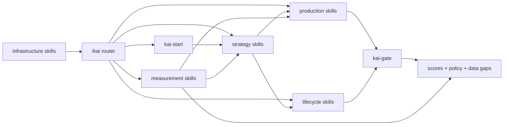

# Kai Public Skill Manifest

This directory is the public API reference for the canonical Kai CMO Harness skill graph. It documents the 45 `kai-*` skill pages under `docs/skill-manifest/`. It excludes `harness/skills/kai` because that directory is the router, and it excludes `harness/skills/kaicalls-design` because it is not a `kai-*` skill.

New to Kai? Start with `/kai-start`, then run `/kai-growth-plan`, `/kai-growth-hacker`, `/kai-landing-page`, `/kai-content-calendar`, `/kai-cro`, or `/kai-gate`. Those commands show the core loop: read the repo, pick distribution, create the work, check the work, and keep the record.

Each page uses the same schema: one-line claim, triggers, inputs, outputs, methodology, dependencies, called-by links, quality gates, provenance, example artifacts, failure modes, and competitive claim. The manifest is meant to be falsifiable: a reader can trace a skill to source files, manifest rule IDs, gate thresholds, dependency links, and known example gaps.

## Skill Graph

## Methodology Surface

- [Rule registry](./rule-registry.md) defines manifest-level IDs such as `AA-*`, `FU-*`, `PE-*`, `QDQ-*`, `AEO-*`, `PROV-*`, `POL-*`, `VG-*`, and `TASTE-*`. These IDs are stable citations derived from local docs; they are not claims that the source files originally carried rule IDs.
- [Example artifact inventory](./example-artifacts.md) lists real repo-local artifacts used by the manifest. Missing examples stay explicit instead of fabricated.
- [Frontend design methodology](../../knowledge/frameworks/design/frontend-design.md) resolves the design framework used by `kai-video-production` and future UI-facing skills.

## Why This Differs From Generic Marketing AI

Generic marketing AI usually returns a draft from a loose prompt. Kai exposes a named skill graph: every skill declares what triggers it, what inputs it needs, which framework rules it applies, what gates can block it, which other skills it composes, what provenance it writes, and when it fails. That makes the system inspectable before anyone runs it.

## Index by Category

### Strategy

- [Kai ABM](./kai-abm.md) - `kai-abm`
- [Kai Brand](./kai-brand.md) - `kai-brand`
- [Kai Brief](./kai-brief.md) - `kai-brief`
- [Kai Budget](./kai-budget.md) - `kai-budget`
- [Kai Competitors](./kai-competitors.md) - `kai-competitors`
- [Kai Growth Hacker](./kai-growth-hacker.md) - `kai-growth-hacker`
- [Kai Growth Plan](./kai-growth-plan.md) - `kai-growth-plan`
- [Kai Partnership](./kai-partnership.md) - `kai-partnership`
- [Kai Topical Map](./kai-topical-map.md) - `kai-topical-map`

### Production

- [Kai Ad Campaign](./kai-ad-campaign.md) - `kai-ad-campaign`
- [Kai Case Study](./kai-case-study.md) - `kai-case-study`
- [Kai Content Calendar](./kai-content-calendar.md) - `kai-content-calendar`
- [Kai HTML Presentation](./kai-html-presentation.md) - `kai-html-presentation`
- [Kai Influencer](./kai-influencer.md) - `kai-influencer`
- [Kai Landing Page](./kai-landing-page.md) - `kai-landing-page`
- [Kai Launch](./kai-launch.md) - `kai-launch`
- [Kai Newsletter](./kai-newsletter.md) - `kai-newsletter`
- [Kai Podcast](./kai-podcast.md) - `kai-podcast`
- [Kai Product Maker](./kai-product-maker.md) - `kai-product-maker`
- [Kai Repurpose](./kai-repurpose.md) - `kai-repurpose`
- [Kai Social](./kai-social.md) - `kai-social`
- [Kai Video](./kai-video.md) - `kai-video`
- [Kai Video Production](./kai-video-production.md) - `kai-video-production`
- [Kai Webinar](./kai-webinar.md) - `kai-webinar`
- [Kai Write](./kai-write.md) - `kai-write`

### Lifecycle

- [Kai Cold Outreach](./kai-cold-outreach.md) - `kai-cold-outreach`
- [Kai Email System](./kai-email-system.md) - `kai-email-system`
- [Kai Retarget](./kai-retarget.md) - `kai-retarget`
- [Kai Retention](./kai-retention.md) - `kai-retention`
- [Kai Sales Meeting Prep](./kai-sales-meeting-prep.md) - `kai-sales-meeting-prep`
- [Kai SDR Operator](./kai-sdr-operator.md) - `kai-sdr-operator`
- [Kai SDR Reply Triage](./kai-sdr-reply-triage.md) - `kai-sdr-reply-triage`

### Measurement

- [Kai Analytics](./kai-analytics.md) - `kai-analytics`
- [Kai Audit](./kai-audit.md) - `kai-audit`
- [Kai CRO](./kai-cro.md) - `kai-cro`
- [Kai Daily Ad Review](./kai-daily-ad-review.md) - `kai-daily-ad-review`
- [Kai Data Dashboard](./kai-data-dashboard.md) - `kai-data-dashboard`
- [Kai Gate](./kai-gate.md) - `kai-gate`
- [Kai Monthly Audit](./kai-monthly-audit.md) - `kai-monthly-audit`
- [Kai Reddit Listen](./kai-reddit-listen.md) - `kai-reddit-listen`
- [Kai SEO Audit](./kai-seo-audit.md) - `kai-seo-audit`
- [Kai Surround Sound](./kai-surround-sound.md) - `kai-surround-sound`
- [Kai Taste](./kai-taste.md) - `kai-taste`
- [Kai Weekly Audit](./kai-weekly-audit.md) - `kai-weekly-audit`

### Infrastructure

- [Kai Start](./kai-start.md) - `kai-start`

## Coverage

| Surface | Count | Notes |
|---|---:|---|
| Canonical `harness/skills/kai-*` pages | 45 | One manifest page per canonical public `kai-*` skill page. |
| Router/helper directories excluded | 2 | `harness/skills/kai` and `harness/skills/kaicalls-design`. |
| Public router commands listed by `/kai` | 42 | Router-visible commands remain separate from the full canonical skill inventory. |
| Manifest rule IDs | 82 | Defined in `rule-registry.md`; derived from local methodology docs. |
| Skills with real repo-local example artifacts | 22 | Listed in `example-artifacts.md`. |
| Skills with explicit example gaps | 22 | Pages state `No committed example artifact found.` |
