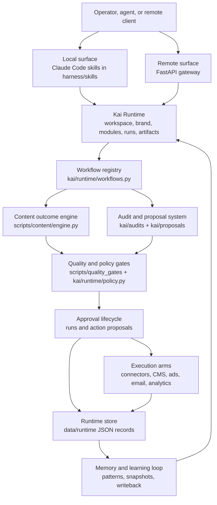
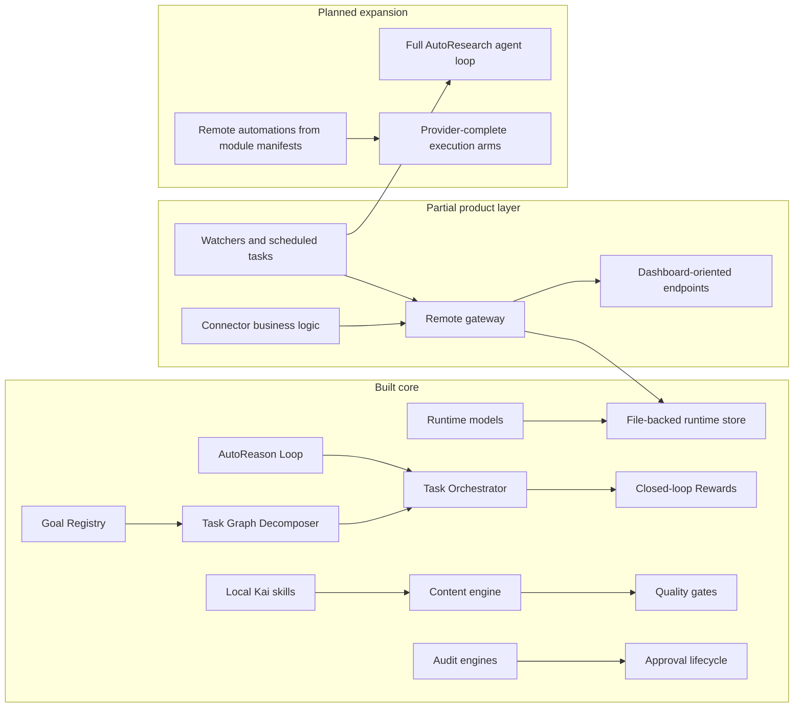

# Kai System Guide

This folder is the reader-facing map of the Kai CMO Harness. It explains how the runtime, skills, content engine, quality gates, approvals, gateway, connectors, background work, instruction contract, recommendation ethics, and evaluation doctrine fit together.

Use this guide when you want to understand the product without reading every Python module first.

## One-Screen Map

## Start Here

| Reader | Best first page | Why |
|---|---|---|
| New repo reader | [Runtime Map](runtime-map.md) | Names the main nouns and where they live. |
| Operator comparing skills | [Public Skill Manifest](../skill-manifest/README.md) | Documents every canonical `kai-*` skill with triggers, inputs, methodology, gates, dependencies, provenance, examples, and failure modes. |
| Engineer adding a workflow | [Schema Catalog](schema-catalog.md) | Shows the contracts workflows must preserve. |
| Engineer debugging a run | [Execution Lifecycle](execution-lifecycle.md) | Follows a run from request to artifact to approval. |
| Operator reviewing safety | [Governance and Quality](governance-and-quality.md) | Explains quality gates, provenance, policy, and holds. |
| Engineer wiring remote work | [Remote and Connectors](remote-and-connectors.md) | Shows gateway, jobs, connectors, and background tasks. |

## System Pages

- [Runtime Map](runtime-map.md): product layers, runtime nouns, module activation, code map, and the Goal & Task decomposer registry.
- [AutoResearch Specification](autoresearch-variants.md): Literature analysis, A/B landing page optimizer, and ad bidding experiment loop specification.
- [Public Skill Manifest](../skill-manifest/README.md): versioned API-style docs for all 44 canonical `harness/skills/kai-*` skill directories.
- [Execution Lifecycle](execution-lifecycle.md): local generation, audit/proposal flow, run states, and action states.
- [Governance and Quality](governance-and-quality.md): authoritative inventory, instruction contract, recommendation ethics, KaiCalls fit logic, evaluation doctrine, quality gate pipeline, audit provenance, approval policy, and memory writeback.
- [Remote and Connectors](remote-and-connectors.md): FastAPI gateway, job queue, connector maturity, scheduled tasks, and integration shape.
- [Schema Catalog](schema-catalog.md): JSON Schema contracts and example payloads.

## Machine-Readable Schemas

The JSON Schema files live in [schemas/](schemas/). They document the runtime contracts already represented in code:

- `KaiWorkspaceProfile`
- `KaiBrandProfile`
- `KaiModuleManifest`
- `WorkflowDefinition`
- `KaiGoal`
- `TaskGraph`
- `TaskNode`
- `KaiRunRequest`
- `KaiRunRecord`
- `KaiArtifactRecord`
- `KaiRuntimeState`
- `ActionProposal`
- `ActionReward`

The schemas are documentation-first. They are meant to help API clients, docs tooling, dashboards, and future tests align on the same contract.

## Maturity Legend

| Status | Meaning |
|---|---|
| Built | Code exists and is part of the working path. |
| Partial | The shape is present, but some providers, transports, or product wiring are incomplete. |
| Planned | Described by docs or manifests, but not a complete runtime path yet. |

## Current Product Shape

