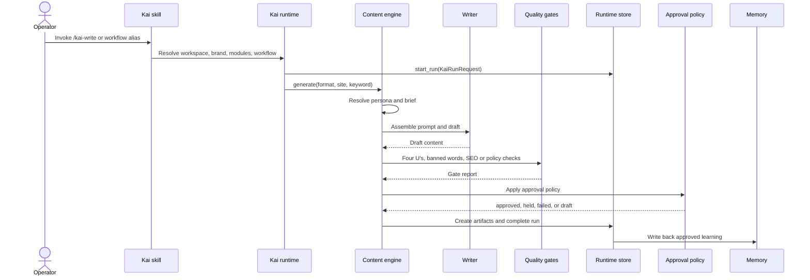
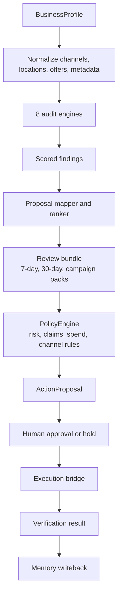
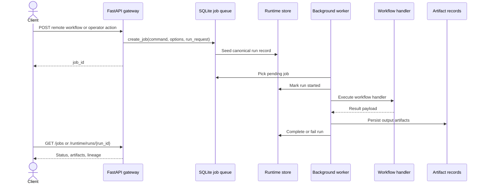
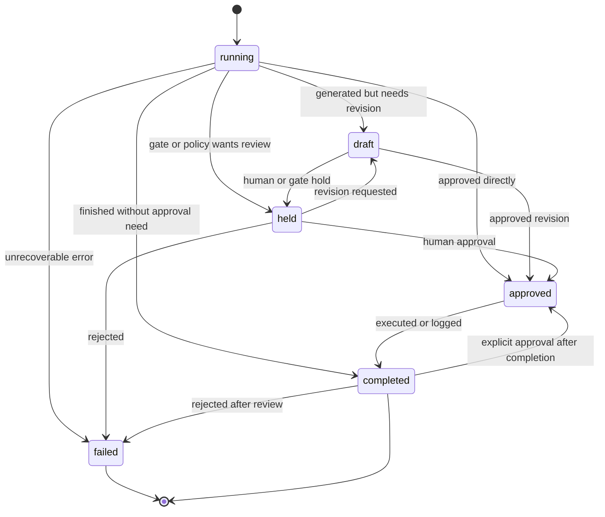
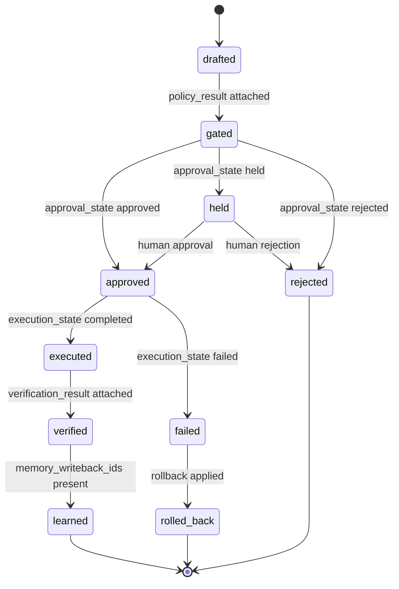
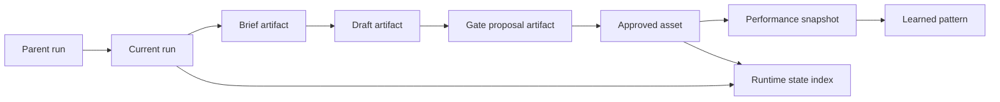

# Execution Lifecycle

Kai has three major execution loops:

1. Local content generation through skills and `scripts/content/engine.py`.
2. Programmatic audits that produce findings, proposals, bundles, and action candidates.
3. Remote jobs and operator actions through the FastAPI gateway.

All three should preserve the same runtime contract: request, run record, artifacts, approval, state update, memory or result writeback.

## Local Content Generation

## Audit and Proposal Flow

## Remote Gateway Flow

## Run State Machine

`KaiRunRecord.status` is intentionally small. Workflows can add richer metadata, but the main state should stay readable.

## Action Proposal State

Action proposals are for real-world mutations: website edits, social posts, ad changes, email sends, analytics updates, and similar work. They track both approval and execution.

| Field | Values |
|---|---|
| `approval_state` | `pending`, `approved`, `rejected`, `auto_approved`, `held` |
| `execution_state` | `pending`, `executing`, `completed`, `failed`, `rolled_back` |
| Derived operating state | `drafted`, `gated`, `approved`, `executed`, `verified`, `learned` |

## Lineage

Each run and artifact keeps enough lineage to answer:

- Which request created this output?
- Which parent run or prior artifacts influenced it?
- Which approval or hold decision happened?
- Which artifact should be used as the latest result for a brand and workflow?

