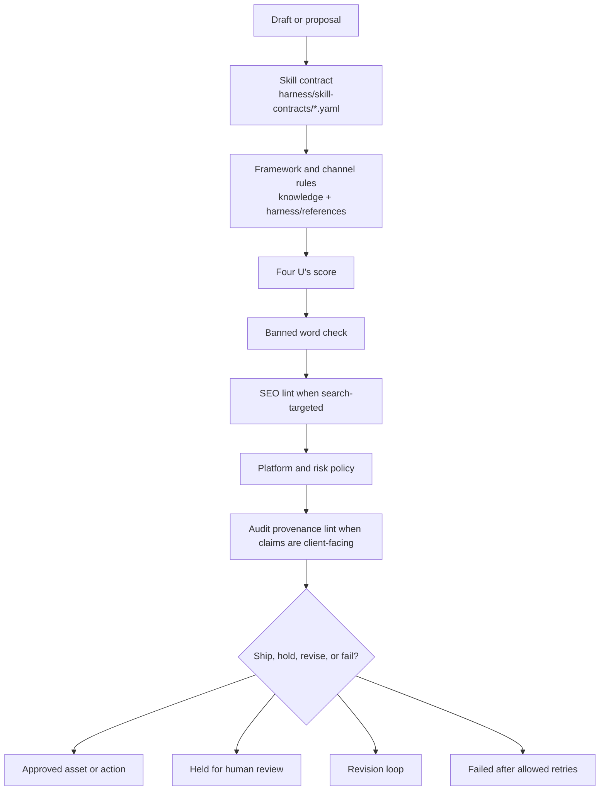
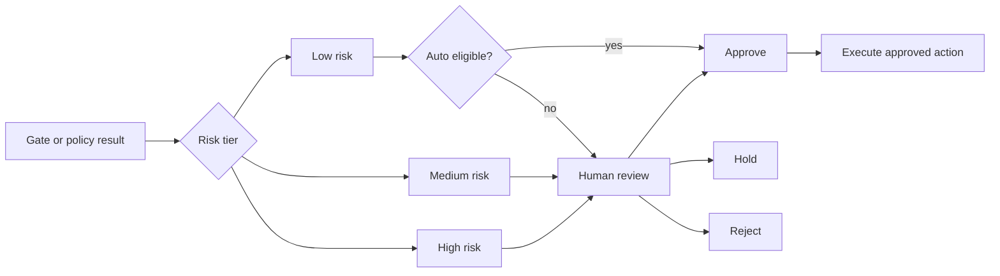
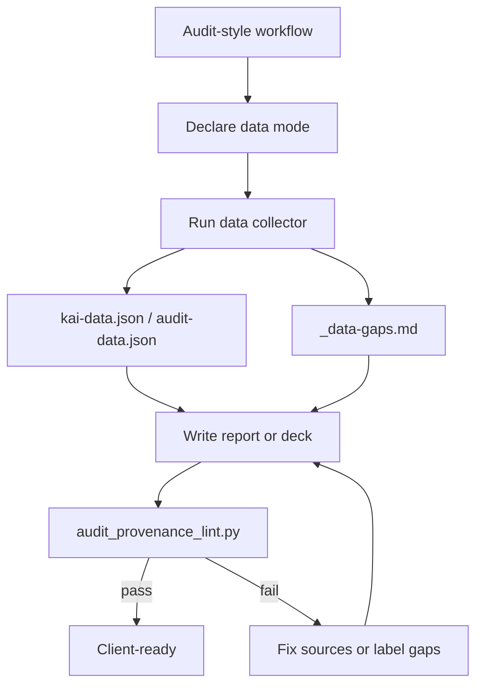
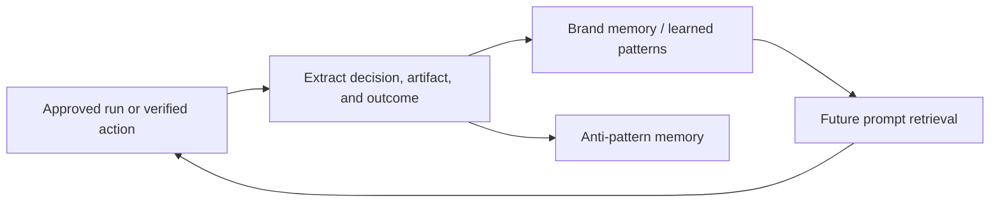

# Governance and Quality

Kai should be useful without being reckless. Governance is split into deterministic gates, platform policy references, provenance rules, approval state, and memory writeback.

## Quality Gate Stack

## Gate Responsibilities

| Gate | Code or source | Blocks on |
|---|---|---|
| Skill contract | `harness/skill-contracts/*.yaml` | Wrong structure, wrong format, missing required sections. |
| Four U's | `scripts/quality_gates/four_us_score.py` | Content below the required usefulness and specificity threshold. |
| Banned words | `scripts/quality_gates/banned_word_check.py` | Tier 1 filler, weak claims, and language that should not ship. |
| SEO lint | `scripts/quality_gates/seo_lint.py` | Search content that breaks structural SEO and Algorithmic Authorship rules. |
| Platform policy | `harness/references/*-ads-*.md`, `kai/runtime/policy.py` | Platform rule violations, regulated claims, personal attributes, unsafe spend changes. |
| Audit provenance | `scripts/quality_gates/audit_provenance_lint.py` | Quantitative or client-facing claims without a source. |
| Agent readiness | `scripts/quality_gates/agent_readiness_lint.py` | Site-level AEO work when robots, llms.txt, schema, or JS access block AI-readiness. |

## Approval Decision Model

## Provenance Rule

For audits, reports, decks, competitor teardowns, CRO work, analytics plans, growth plans, and retrospectives:

- Declare the data mode: `sales_external`, `onboarding_connected`, or `internal_demo`.
- Collect data before writing with `python -m scripts.audit.collect --url <url> --mode <mode> --workflow <workflow> --out <data-folder>`.
- Cite collector sources for client-facing numbers.
- Put missing inputs in `_data-gaps.md`.
- Run `python scripts/quality_gates/audit_provenance_lint.py <audit-folder> --audit-dir` before handoff.

## Memory Writeback

Approved work can become future context. Rejected, held, and failed work should still be visible for observability, but should not silently become a learned pattern.

## Practical Rule

Any workflow that can change a live channel should produce an `ActionProposal` first. The proposal should contain:

- proposed changes
- evidence
- risk tier
- policy result
- preview artifact when possible
- verification criteria
- rollback reference when needed

