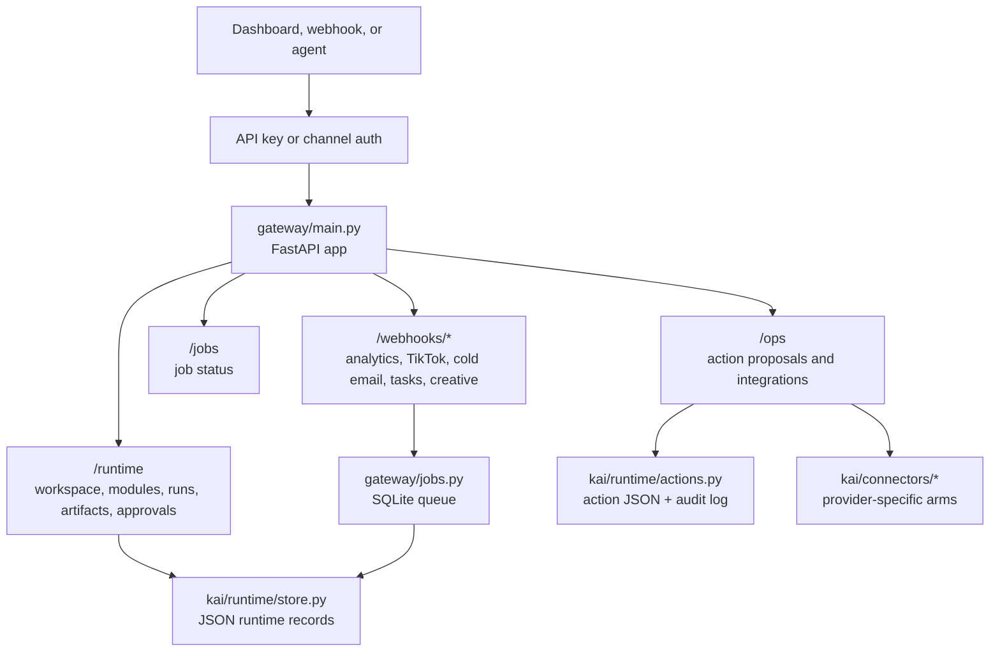
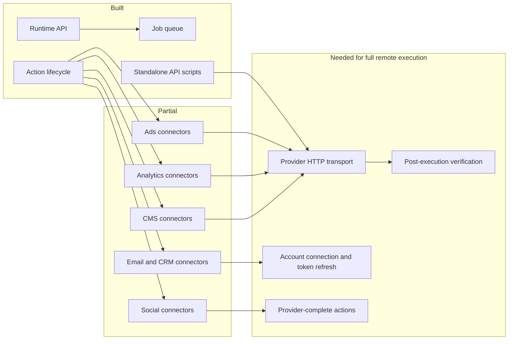
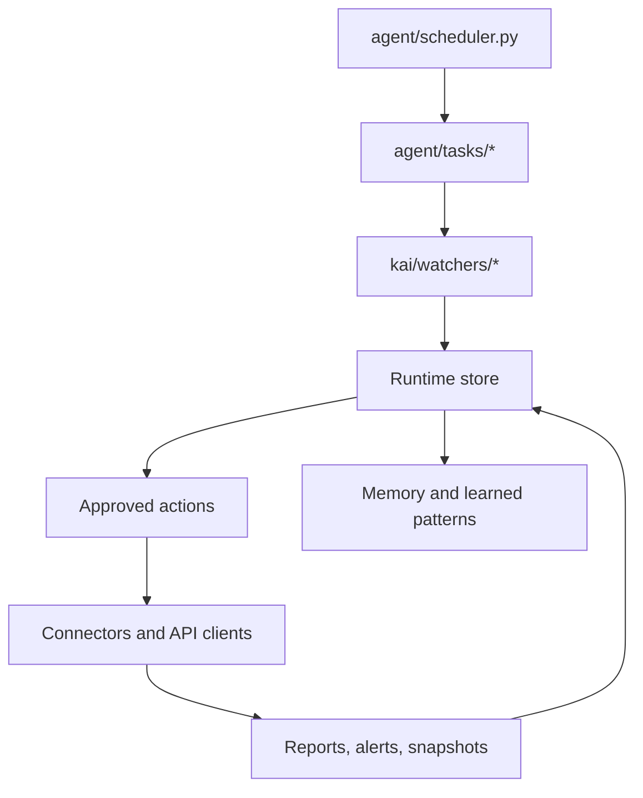

# Remote and Connectors

The remote surface lets dashboards, webhooks, scheduled tasks, and agents use the same runtime contracts as local skills.

## Gateway Topology

## Remote Endpoints

| Prefix | Router | Role |
|---|---|---|
| `/runtime` | `gateway/routers/runtime.py` | Workspace, brands, modules, runs, artifacts, lineage, approvals. |
| `/ops` | `gateway/routers/actions.py` | Action proposals, approvals, action history, integration registry. |
| `/jobs` | `gateway/routers/jobs.py` | Async job status and result lookup. |
| `/connections` | `gateway/routers/connections.py` | Connection-oriented remote state. |
| `/daemon` | `gateway/routers/daemon.py` | Daemon and operator loop support. |
| `/webhooks/analytics` | `gateway/routers/analytics.py` | Analytics webhook handling. |
| `/webhooks/creative` | `gateway/routers/creative.py` | Creative webhook handling. |
| `/webhooks/cold-email` | `gateway/routers/cold_email.py` | Cold email webhook handling. |
| `/webhooks/tasks` | `gateway/routers/tasks.py` | Task integration hooks. |
| `/webhooks/tiktok` | `gateway/routers/tiktok.py` | TikTok integration hooks. |
| `/webhooks/whatsapp` | `gateway/routers/whatsapp.py` | WhatsApp/Twilio channel hooks. |

## Connector Maturity

## Brain, Nervous System, Arms

Kai follows a simple remote execution model:

| Layer | Responsibility | Examples |
|---|---|---|
| Brain | Decides what should happen and why. | audits, proposals, ranking, campaign plans |
| Nervous system | Carries state, risk, approval, and lineage. | run records, action proposals, policy results, audit logs |
| Arms | Executes approved channel-specific actions. | WordPress, Shopify, Meta, Google Ads, email, social, analytics |

Arms should observe, execute approved actions, and report results. They should not invent strategy outside the approved contract.

## Scheduled and Background Work

## Remote Contract Rules

- Every remote invocation should create or reference a `KaiRunRequest`.
- Every long-running unit should have a job id and a run id.
- Every output should be an artifact, not only a raw API response.
- Every live mutation should be represented as an `ActionProposal`.
- Every action should carry a policy result before approval.
- Every execution result should update state and keep enough evidence for verification.

