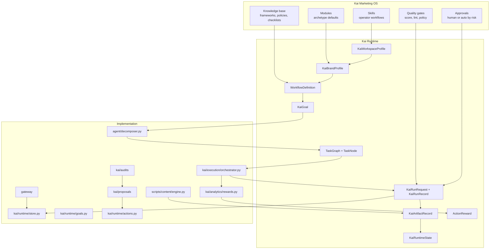
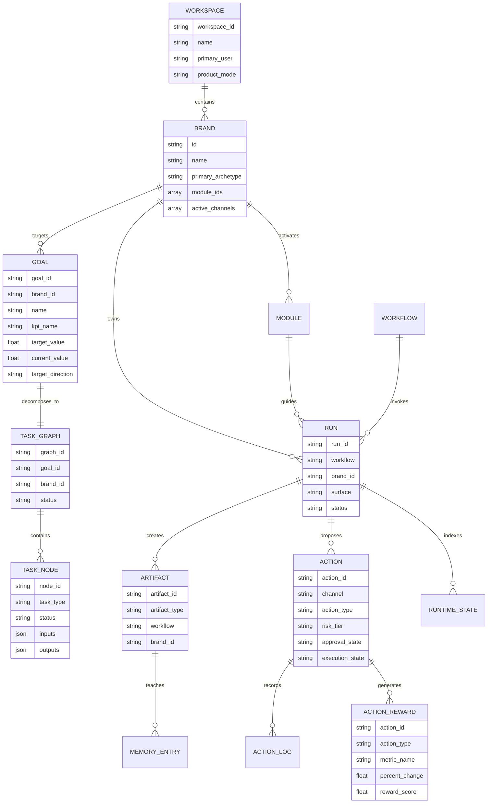
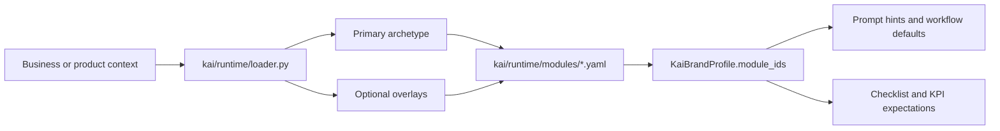

# Runtime Map

Kai is organized around a small set of runtime nouns. The docs and code should keep pointing back to these nouns so new workflows do not invent parallel contracts.

Authoritative inventory lives in [Governance and Quality](governance-and-quality.md): 46 skill directories, 44 canonical `kai-*` skill docs, 40 public `/kai` router commands, 48 playbook docs, 32 checklists, 27 framework docs, 17 channel guides, 8 audience persona profiles, 18 harness references, and 18 skill contracts. The [Public Skill Manifest](../skill-manifest/README.md) is the API-style reference for those canonical skills.

## Layer Model

## Runtime Nouns

| Noun | Code source | Purpose |
|---|---|---|
| Workspace profile | `kai/runtime/models.py` | Describes the workspace, available surfaces, enabled plugins, and brands. |
| Brand profile | `kai/runtime/models.py` | Describes one business target: URL, archetype, channels, proof, personas, and metadata. |
| Goal | `kai/runtime/models.py` | Describes a high-level business goal or target KPI (e.g. increase CTR). |
| Task Graph / DAG | `kai/runtime/models.py` | A validated, cycle-free Directed Acyclic Graph of subtasks to resolve a goal discrepancy. |
| Task Node | `kai/runtime/models.py` | An individual subtask node within a Task Graph, representing a specific type of agent work. |
| Module manifest | `kai/runtime/modules/*.yaml` | Adds archetype defaults: trigger words, prompt hints, required memory, workflows, KPIs, subagents, and automation names. |
| Workflow definition | `kai/runtime/workflows.py` | Maps product workflows to handlers, input contracts, output artifacts, quality policy, aliases, and risk. |
| Run request | `kai/runtime/models.py` | The cross-surface invocation contract for local and remote execution. |
| Run record | `kai/runtime/models.py` | The persisted lifecycle record for a run, including status, lineage, artifacts, inputs, outputs, and timestamps. |
| Artifact record | `kai/runtime/models.py` | The persisted output contract for briefs, drafts, audits, plans, snapshots, and learned patterns. |
| Action reward | `kai/analytics/rewards.py` | Represents computed performance scores (e.g. percentage metric change * confidence) logged for closed-loop learning. |
| Runtime state | `kai/runtime/models.py` | A derived index of latest runs and artifacts by brand and workflow. |
| Action proposal | `kai/runtime/actions.py` | The contract for real-world marketing mutations such as publishing, editing, or changing spend. |

## Data Model

## Module Activation

Module activation turns a business profile into operating defaults. A local-service brand gets call conversion, reviews, GBP, and speed-to-lead guidance; an ecommerce brand gets creative, product pages, retention, and paid social guidance.

## Code Map

| Area | Files |
|---|---|
| Canonical models | `kai/runtime/models.py` |
| Goal Registry & Storage | `kai/runtime/goals.py` |
| Task Graph Decomposer | `agent/decomposer.py` |
| Task Orchestrator | `kai/execution/orchestrator.py` |
| Closed-loop Rewards | `kai/analytics/rewards.py` |
| Workspace and module loading | `kai/runtime/loader.py`, `kai/runtime/modules/*.yaml` |
| Workflow registry | `kai/runtime/workflows.py` |
| Persistence | `kai/runtime/store.py`, `kai/runtime/actions.py` |
| Content generation | `scripts/content/engine.py`, `scripts/content/_writer.py`, `scripts/content/brief_generator.py` |
| Quality gates | `scripts/quality_gates/*.py` |
| Audit and proposals | `kai/audits/`, `kai/proposals/`, `kai/runtime/application_flow.py` |
| Compliance and approval | `kai/compliance/`, `kai/runtime/policy.py`, `scripts/content/approval_policy.py` |
| Remote API | `gateway/main.py`, `gateway/routers/runtime.py`, `gateway/routers/actions.py` |
| Background work | `agent/scheduler.py`, `agent/tasks/` |
