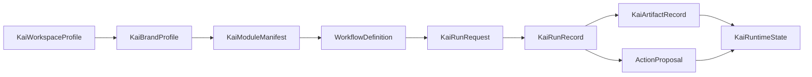

# Schema Catalog

The schema files in [schemas/](schemas/) describe the contracts that tie the system together. They mirror the current dataclasses and registry shapes in `kai/runtime/`, plus the action proposal model in `kai/runtime/actions.py`.

## Schema Index

| Schema | Code shape | Use |
|---|---|---|
| [kai-workspace-profile.schema.json](schemas/kai-workspace-profile.schema.json) | `KaiWorkspaceProfile` | Workspace-level metadata, surfaces, plugins, and brands. |
| [kai-brand-profile.schema.json](schemas/kai-brand-profile.schema.json) | `KaiBrandProfile` | Brand/business target loaded into a workspace. |
| [kai-module-manifest.schema.json](schemas/kai-module-manifest.schema.json) | `KaiModuleManifest` | Archetype module manifest loaded from `kai/runtime/modules/*.yaml`. |
| [workflow-definition.schema.json](schemas/workflow-definition.schema.json) | `WorkflowDefinition` | Product workflow registry entries from `kai/runtime/workflows.py`. |
| [kai-run-request.schema.json](schemas/kai-run-request.schema.json) | `KaiRunRequest` | Local or remote run invocation. |
| [kai-run-record.schema.json](schemas/kai-run-record.schema.json) | `KaiRunRecord` | Persisted run lifecycle record. |
| [kai-artifact-record.schema.json](schemas/kai-artifact-record.schema.json) | `KaiArtifactRecord` | Persisted output artifact. |
| [kai-runtime-state.schema.json](schemas/kai-runtime-state.schema.json) | `KaiRuntimeState` | Derived runtime index. |
| [action-proposal.schema.json](schemas/action-proposal.schema.json) | `ActionProposal` | Proposed real-world marketing mutation. |
| [system-documentation-bundle.schema.json](schemas/system-documentation-bundle.schema.json) | Documentation bundle | Optional manifest for this docs pack. |

## Design Conventions

- Schemas use JSON Schema draft 2020-12.
- Dataclass dictionaries use `snake_case` keys.
- `metadata`, `inputs`, `outputs`, and `data` are intentionally open objects.
- Runtime status enums match the code at the time this guide was added.
- Artifact types match `KaiArtifactRecord.artifact_type`.
- Action approval and execution states match `kai/runtime/actions.py`.

## Minimal Run Request

```json
{
  "intent": "Write a local-service landing page for missed-call capture",
  "workflow": "landing-page",
  "brand_id": "kaicalls",
  "surface": "local",
  "module_set": ["local-service"],
  "inputs": {
    "keyword": "AI receptionist for plumbers",
    "format": "landing-page"
  },
  "metadata": {
    "requested_by": "operator"
  }
}
```

## Contract Chain



## Validation Example

Use any draft 2020-12 JSON Schema validator. A dashboard or API client can validate before sending a remote request:

```bash
jsonschema -i request.json docs/system/schemas/kai-run-request.schema.json
```

The repo does not currently require these schemas at runtime. They are contract documentation that can be promoted into tests later.

