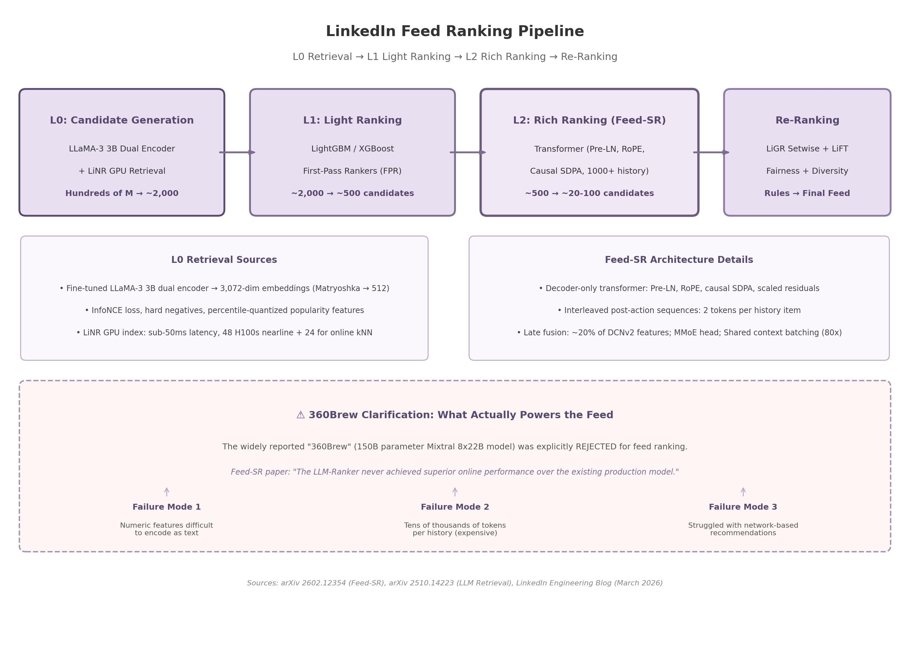

# LinkedIn's AI Systems: A Comprehensive Technical Deep Dive

## Patents, Algorithms, Architecture, and Reverse Engineering

---

## 1. Executive Summary

### 1.1 Research Scope and Methodology

This report derives from a multi-agent research operation spanning 300+ independent searches across twelve technical dimensions. Primary sources include arXiv preprints from LinkedIn Engineering (the Feed-SR paper ^1^, the 360Brew paper ^2^, the AAAI 2026 retrieval paper ^3^), USPTO patent filings, KDD and AAAI conference proceedings, third-party black-box audits, reverse-engineering analyses, and LinkedIn Engineering blog posts. Cross-verification protocols classified findings into confidence tiers, with conflicting claims resolved through primary-source hierarchy.

### 1.2 Key Findings at a Glance

**The prevailing narrative of LinkedIn's feed architecture is factually wrong.** Industry observers widely attribute feed ranking to "360Brew," a 150-billion-parameter foundation model. Primary source documents from LinkedIn Engineering demonstrate that 360Brew was evaluated and explicitly rejected for feed ranking: "The LLM-Ranker never achieved superior online performance" ^4^. Numeric features lost precision when verbalized as text, member interaction histories consumed tens of thousands of tokens per example, and network relationship signals degraded when converted to descriptions ^4^. The term "360Brew" has been appropriated as marketing shorthand; third-party analyses claiming to measure its impact are measuring the production system instead.

The architecture that actually ranks the feed is a four-stage cascaded pipeline: L0 candidate generation via a fine-tuned LLaMA-3 3B dual encoder; L1 light ranking via LightGBM/XGBoost calibration; L2 rich ranking via Feed-SR, a compact decoder-only transformer achieving +2.10% time spent in A/B tests ^1^; and re-ranking via LiGR setwise attention, LiFT fairness adjustments, and business-rule filtering ^5^ ^6^. Feed-SR uses approximately 20% of its predecessor's feature set — a shift from feature-engineering-heavy recommendation to architecture-driven learning ^4^. The retrieval model consolidated five legacy systems and delivered +3.29% revenue for newer members ^3^. This "retrieval-ranking split" — small LLM for retrieval, compact transformer for ranking — outperforms monolithic large-model approaches on accuracy and serving economics.

On content integrity, LinkedIn's "AI solving AI" framework uses a hybrid human-machine pipeline targeting generic AI-written posts, bot comments, and attention-bait videos ^7^. Human editors annotate thousands of posts; trained classifiers enforce distribution suppression rather than removal, limiting flagged content to first-degree connections without creator notification ^8^. Independent analysis reveals a five-layer signal hierarchy: pattern-level markers ("contrastive construction" phrasing), vocabulary-level excess-word detection ("delve" spiked at r=28.0 over pre-LLM baseline ^9^), structural variance, engagement telemetry (AI posts produce 2–4s dwell versus 8–15s for human content ^10^), and account-level temporal consistency. Pod detection accuracy is reported at 97% ^11^. Originality.ai found 54% of long-form posts are AI-assisted, a 189% surge since ChatGPT's launch, with AI posts receiving 45% less engagement ^12^ ^13^.

Independent studies confirm a structural visibility redistribution. Van der Blom's analysis of 1.8 million posts documented a ~50% organic reach drop alongside Top Creator visibility doubling from 15% to 31% ^14^ ^15^. AuthoredUp's 3-million-post study found one save produces ~5× the reach of one like, with delayed engagement (24–72 hours) outperforming first-hour peaks by 4–6× in suggested feeds ^16^ ^17^. The platform increasingly rewards semantic relevance over network proximity.

The graph infrastructure processes a heterogeneous Economic Graph of 100 billion-plus nodes ^18^. LiGNN delivers production metrics including +2.0% Ads CTR lift ^19^; LinkSAGE improves qualified applications by up to +3.2% for cold-start job seekers ^20^. This compositional architecture — GNNs encoding relational structure, LLMs encoding semantics, transformer rankers sequencing behavior — enables unified AI at billion-member scale.

On personnel, Deepak Agarwal returned as Chief AI Officer in January 2025 for his second tenure ^21^, following departures of Ya Xu (1,000-person Data & AI org leader) to Google DeepMind ^22^and Qingquan Song (core LiRank contributor) to OpenAI ^23^. The current triad comprises Agarwal at strategy, Hamed Firooz (~50-person FAIT team) at foundation models ^24^, and Karthik Ramgopal (Distinguished Engineer) at the GenAI platform level .

LinkedIn's IP strategy is tripartite: patent general frameworks (US9626654B2 for job ranking ^25^, US9811569B2 with 78 forward citations ^26^), open-source infrastructure to build industry dependency (Apache Kafka at 7 trillion messages/day ^27^, Apache Pinot at 250,000+ queries/second ^28^), and protect core model weights as trade secrets. No patents exist for 360Brew or AI content detection — rapidly evolving systems are protected by secrecy ^29^.

Fairness presents the sharpest claim-verification gap. LinkedIn's DetGreedy algorithm improved gender-representative queries from 33% to 95% in 2018 ^30^, with LiFT open-sourced in 2020 ^31^. Yet the Korolova et al. AAAI 2026 audit found MinSkew at early ranks (k=25, k=50) — where hiring decisions occur — was significantly worse than self-reported aggregates, with women churning ~0.07 units more than men at top positions ^32^. An IZA field experiment found men's profiles are 11.5% more likely to be recruiter-viewed ^33^. The EU AI Act classifies LinkedIn's HR AI as high-risk, requiring full compliance by August 2026 with systematic bias testing and independent conformity assessments ^34^.

The infrastructure layer — Kafka, Pinot, Feathr, Liger Kernel (60% GPU memory reduction ^35^), Pro-ML Health Assurance — demonstrates that LinkedIn's advantage rests on systems-level capability, not any single model. The convergence of independent audits, regulatory mandates, adversarial content generation, and talent pressure marks a defining period: the systems determining who gets hired and who gets seen are entering an era of external accountability that internal metrics alone cannot satisfy.

---

## 2. The "AI Solving AI" Content Detection System

### 2.1 The Three-Target Detection Framework

LinkedIn's content volume grew 14% year over year as of mid-2026, a surge VP of Product Laura Lorenzetti explicitly tied to the proliferation of generative AI tools: "Content creation on the platform is up 14% year over year... the timing of that is very clearly at the moment that there was a rise in AI" ^7^. In response, LinkedIn deployed a detection framework it terms "AI solving AI" — a hybrid human-machine pipeline that classifies and suppresses low-quality content without removing it outright. The system operates against three distinct threat categories, each requiring different detection signals and enforcement mechanisms.

#### 2.1.1 Generic AI-Written Posts

The primary target is what the platform and industry observers call "AI slop" — posts that exhibit the structural and linguistic signatures of large language model (LLM) generation without contributing original perspective. LinkedIn's engineering team collaborated with its in-house editorial staff to define the boundary between acceptable AI-assisted content and suppressible generic output, training classifiers to recognize "what adds perspective, context, or expertise versus what simply repeats existing ideas without contributing anything new" ^8^. The detection approach is outcome-based rather than authorship-based: instead of determining whether a post was AI-generated, the system measures whether the content produces quality engagement signals. This design choice matters because high-quality human editing of AI drafts produces writing that is structurally indistinguishable from purely human output, rendering authorship detection unreliable at scale ^10^.

#### 2.1.2 Bot Comments

The second target comprises automated or semi-automated comments, including those generated by browser extensions and engagement pod tools. LinkedIn is building dedicated classifiers that analyze both "the actual language in the comments, and also the patterns and volume in which comments are posted" ^7^. The behavioral dimension is critical: if a user posts 20 comments in 5 minutes, the activity pattern itself triggers flags regardless of comment content ^36^. LinkedIn's machine learning models reportedly identify pod-like behavior with 97% accuracy, detecting sequential engagement (the same group of accounts commenting in predictable order), excessive reciprocity ratios, limited engagement diversity outside pod networks, and semantic similarity across comments ^11^. Enforcement escalates from soft restriction (comments silently hidden for 24–72 hours) through temporary suspension (7–30 days with identity verification) to permanent commenting restrictions ^36^. The 97% figure, widely cited across multiple third-party sources, has not been independently verified and likely reflects detection of obvious coordinated behavior rather than sophisticated evasion ^11^.

#### 2.1.3 Attention-Bait Videos

The third and newest target, announced in May 2026, is what Lorenzetti termed "attention-bait videos" — content "designed purely to keep people watching without adding real value" ^7^. Examples include lengthy videos of construction accidents paired with generic workplace safety advice, or extended manufacturing footage accompanied by vague business platitudes. These videos are typically cross-posted from platforms like Instagram and TikTok where they performed well, then imported to LinkedIn with minimal adaptation to exploit the professional audience ^7^. Detection relies on identifying mismatches between visual content and claimed professional insight, combined with cross-platform provenance signals. Lorenzetti characterized the phenomenon as "doing what AI slop is doing but in a much more visual way" ^7^.

### 2.2 The Human-in-the-Loop Annotation Pipeline

#### 2.2.1 Editorial Annotation at Scale

The foundation of LinkedIn's detection system is a supervised learning pipeline built on human editorial judgment. Human editors and content managers annotate thousands of posts, applying binary labels — "generic" versus "original" — based on detailed rubrics defining low- and high-quality content ^7^. Multiple reviewers evaluate each post to ensure inter-annotator consistency, though LinkedIn has not disclosed specific agreement metrics such as Cohen's kappa ^7^. Industry best practices for binary content quality labeling target Cohen's kappa ≥ 0.80, with expert adjudication for disagreement cases rather than majority voting, which systematically suppresses minority labels that are often correct on ambiguous inputs ^8^. The editorial-engineering partnership is operationally unusual: most platforms rely on outsourced annotators or pure ML engineering teams, whereas LinkedIn integrates its in-house editorial staff directly into classifier development ^8^.

#### 2.2.2 From Labels to Production Classifiers

Annotated labels train machine learning classifiers that operate at platform scale. LinkedIn's internal AutoML framework, described by engineers Shubham Agarwal and Rishi Gupta, reduced model development and retraining time from approximately two months to less than one week by automating data preparation, feature transformation, architecture search, and deployment ^37^. The same framework likely powers the AI content detection pipeline, enabling quarterly or more frequent model calibration updates as content patterns evolve. This rapid iteration cycle is essential because detection signals become obsolete as content generators adapt — the "announced signals become obsolete" dynamic that creates a structural treadmill for the platform.

#### 2.2.3 Distribution Suppression: The Shadowban-Lite Approach

Flagged content receives distribution suppression rather than removal — a policy Lorenzetti confirmed directly and which LinkedIn frames as distinguishing between "AI-assisted" content (welcome, if original) and "AI slop" (suppressed) ^8^. Suppressed posts remain visible to first-degree connections and followers but no longer appear in recommendations or reach broader audiences ^8^. This approach avoids the governance and user-experience complications of content deletion while still penalizing low-quality output. However, it creates a transparency gap: creators whose reach is artificially constrained receive no notification, making the penalty functionally invisible. The EU AI Act's high-risk system transparency requirements may eventually force disclosure of suppression decisions, particularly given that LinkedIn's HR-adjacent AI systems already qualify as high-risk under the regulation.

### 2.3 Detection Signals and Reverse-Engineered Classifier

Independent analysis of 10,222 LinkedIn posts from 494 creators, combined with platform disclosures and engineering documentation, reveals a five-layer signal hierarchy. Table 1 synthesizes the known detection signals across each layer.

| Signal Layer | Specific Indicators | Detection Mechanism | Relative Weight |
|---|---|---|---|
| Pattern-level | "Contrastive construction" ("it's not X, it's Y"); generic openers ("In today's fast-paced world"); templated closers ("What do you think?"); engagement bait ("Comment YES if you agree") ^8^ ^38^| Regex + semantic pattern matching; substance-to-ask ratio evaluation | High (explicitly disclosed by LinkedIn) |
| Vocabulary-level | Overused AI-associated terms: "delve," "tapestry," "leverage," "robust," "seamless," "transformative," "paradigm," "holistic," "fostering" ^10^ ^39^| Frequency ratio analysis vs. pre-LLM baselines; academic research shows "delve" spiked r=28.0 over baseline ^9^| Medium-High (5–10x frequency elevation in AI posts) |
| Structural-level | Uniform sentence length; predictable paragraph transitions; consistent paragraph length; em-dash overuse; flat emotional register ^10^| Variance-based classification; "burstiness" (sentence length variance) scoring | Medium (inferred from pre-360Brew classifiers) |
| Engagement-level | Dwell time 2–4s (vs. 8–15s average, 30+s top posts); comment-to-like ratio <0.10; average comment length 4.2 words; share absence ^10^| Real-time engagement telemetry; composite quality scoring | Very High (hardest signal to manipulate) |
| Account-level | Unnaturally consistent posting style across 20+ posts; identical structure (hook length, body paragraphs, conclusion pattern) ^10^| Temporal pattern analysis; cross-post structural similarity | Medium (not officially confirmed) |

*Table 1: Reverse-engineered detection signal hierarchy for LinkedIn's AI content classifier. Relative weights are inferred from platform disclosures and independent data analysis.*

#### 2.3.1–2.3.5 Signal Analysis

The pattern-level signals are the most publicly visible because LinkedIn explicitly disclosed targeting the "contrastive construction" form — the "it's not X, it's Y" phrasing that became a widespread AI text signature in 2024–2025 ^8^. This disclosure itself is strategically notable: by announcing the signal, LinkedIn triggered an immediate adversarial response from content generators, who simply dropped the pattern. Industry analyst Shelly Palmer described this as a "treadmill" dynamic where detection is perpetually one step behind generation ^8^.

Vocabulary-level detection draws on academic research published in *Science Advances* (Kobak et al., 2025), which identified hundreds of "excess words" that spiked in post-LLM text corpora ^9^. The word "delve" showed a frequency ratio of r=28.0 over its pre-LLM baseline — a statistical anomaly that classifiers can detect with high precision. Production lexicons at LinkedIn and third-party content quality tools track dozens of these markers, though individual word usage is never penalized in isolation; it is the density of markers within a post that triggers classification ^10^ ^39^.

Structural signals operate on variance metrics. AI content exhibits measurably lower variance across vocabulary distribution, sentence structure variety, transition patterns, and emotional range ^10^. As one analyst summarized: "Every sentence is roughly the same length. Every paragraph follows the same structure. The emotional register stays flat. A classifier trained on these features doesn't need to know if content is AI-generated. It just needs to know if it's boring" ^10^.

Engagement-level signals carry the highest weight because they are the most difficult to manipulate. Dwell time — the duration a user spends viewing a post — is considered the primary quality signal: you can purchase likes and comments, but you cannot force eyeballs to remain on content that fails to engage. AI-generated posts produce 2–4 seconds of dwell time compared to 8–15 seconds for the average post and 30+ seconds for top-performing content ^10^. The comment-to-like ratio provides a secondary diagnostic: AI posts average 0.06 (6 comments per 100 likes) versus 0.18 for the dataset overall, and human-marked posts with high engagement can reach 0.25 or higher ^10^. Average comment length on AI posts is 4.2 words versus 18.7 words on human-written posts with strong engagement — a nearly 5x differential that functions as a content quality proxy ^10^.

Account-level signals target automation rather than individual posts. If a user's last 20 posts follow identical structural templates — similar hook length, similar body paragraph count, similar conclusion with a question — the algorithm gradually reduces account-level distribution ^10^. This temporal consistency signal is particularly effective against scheduled AI content pipelines that post at regular intervals with structurally uniform output.

### 2.4 Performance and Platform Comparison

#### 2.4.1 Performance Impact of AI Content

The quantitative case for LinkedIn's crackdown is substantial. An analysis of 10,222 posts by ViralBrain found that probable AI posts achieved an average engagement rate of 0.31%, compared to 0.67% for the overall dataset — performing at roughly half the general rate ^10^. The viral rate differential is starker: AI posts went viral at 0.8% versus 2.16% overall, meaning pure AI content achieves viral distribution at approximately one-third the normal rate ^10^. A separate study by Originality.ai, analyzing 3,368 posts from 99 influential LinkedIn profiles between January and November 2025, found that 53.7% of long-form posts were likely AI-generated — representing a 189% surge since ChatGPT's launch — and that likely AI posts received 45% less engagement than likely original posts ^12^.

These metrics demonstrate that the detection system is not merely identifying AI content — it is identifying content that fails to produce quality engagement outcomes. When AI-generated posts do go viral, it is typically because the topic itself is trending rather than because the content is exceptional ^10^. LinkedIn reports that initial results from the crackdown are "encouraging," though no specific quantitative improvement metrics have been disclosed ^40^.

#### 2.4.2 Cross-Platform Detection Strategies

LinkedIn's approach diverges meaningfully from that of other major platforms. Table 2 compares the four dominant strategies.

| Dimension | LinkedIn | X (Twitter) | Meta (Facebook/Instagram) |
|---|---|---|---|
| **Detection approach** | Quality-outcome based: dwell time, comment substance, share rate, structural variance ^10^| Community Notes + limited auto-detection + self-disclosure labels ^41^| C2PA metadata + visual pattern recognition + behavioral monitoring ^41^ ^42^|
| **Primary signals** | Engagement quality (2–4s dwell time), semantic similarity clusters, account consistency ^10^| Crowdsourced fact-checking, pre-share alerts, "Made with AI" labels ^41^| Content Credentials (C2PA) watermarking, photorealistic image classifier, Few-Shot Learner (FSL) adaptation ^42^|
| **Enforcement action** | Distribution suppression (shadowban-lite): visible to 1st-degree only ^8^| Revenue program suspension for undisclosed AI; Community Note attachment ^41^| Content removal for unlabeled photorealistic AI; mandatory C2PA labels ^41^|
| **AI content policy** | AI-assisted content welcome if original; "AI slop" suppressed ^8^| Relies on self-disclosure; generally permissive ^41^| Mandatory labels for photorealistic AI-generated imagery ^41^|
| **Key strength** | Hardest to game (outcome-based, not input-based) ^10^| Community accountability; low false positive rate | Industry-leading metadata infrastructure; cross-platform consistency |
| **Key weakness** | Opaque suppression without creator notification; arms race with disclosed signals | Dependent on volunteer participation; minimal proactive detection | Metadata dependent (C2PA requires generator compliance); visual detection gaps |

*Table 2: Cross-platform comparison of AI content detection and enforcement strategies, 2026.*

LinkedIn's quality-outcome approach offers a structural advantage over authorship detection because it does not require distinguishing between human and AI origin — it measures what audiences actually do with the content. An empirical audit by Indicator (Dais.ca, 2025) tested C2PA-based labeling across platforms and found that social media platforms correctly labeled only 169 of 516 AI-generated posts (33%), with LinkedIn labeling 25 of the tested posts — mid-range performance that predated the newer quality-based suppression system ^43^.

Meta's approach represents the most technically sophisticated metadata infrastructure, using the Coalition for Content Provenance and Authenticity (C2PA) standard to cryptographically verify image origins and its Few-Shot Learner (FSL) system to adapt detection models to new content types with minimal labeled examples ^42^. X's reliance on Community Notes places detection burden on volunteer moderators rather than platform algorithms, making it the most permissive major platform for AI content ^41^.

#### 2.4.3 The Arms Race Problem

LinkedIn's detection framework faces a fundamental structural challenge: every disclosed signal becomes an immediate target for adversarial adaptation. When the platform announced it was targeting "it's not X, it's Y" phrasing, content generators simply eliminated that pattern. The em-dash overuse episode demonstrated the same dynamic — a structural feature that classifiers weighted heavily until it became widely known, at which point generators adjusted punctuation patterns to evade detection ^8^.

This feedback loop is not unique to LinkedIn. OpenAI discontinued its own AI text classifier in July 2023, citing a "low rate of accuracy" and the fundamental difficulty of distinguishing human-edited AI content from purely AI-generated text ^10^. The sustainable defensive position, as LinkedIn's architecture implicitly recognizes, is not authorship detection but quality detection — measuring whether content produces the engagement patterns characteristic of genuine audience interest, regardless of how it was produced. Dwell time, meaningful comments, and share rates are harder to manufacture than linguistic patterns because they require actual human attention rather than text manipulation.

The platform's long-term bet appears to rest on this asymmetry: structural features can be mimicked, but engagement outcomes cannot. If the system consistently suppresses content that produces 2–4 second dwell times and generic one-word comments, the incentive shifts from evading detection to producing content that genuinely engages audiences — whether AI-assisted or fully human-written. Content creation on LinkedIn is up 14% year over year, and as Lorenzetti noted, "a lot of people can produce a lot of very low-quality content" ^7^. The detection system's goal is not to stop AI usage but to ensure that AI-generated volume does not displace genuine professional insight in the feed — a calibration that will require continuous adjustment as both generation and detection technologies advance.

---

## 3. Feed Ranking Architecture: What Actually Powers LinkedIn

The popular narrative holds that LinkedIn's feed is ranked by "360Brew," a 150-billion-parameter foundation model that replaced thousands of separate recommendation systems in a single sweeping overhaul. That narrative is wrong. Primary source documents from LinkedIn Engineering — the Feed-SR paper published February 2026 ^1^, the LLM-based retrieval paper presented at AAAI 2026 ^3^, and the official LinkedIn Engineering blog announcement ^44^— describe a fundamentally different architecture: a four-stage production pipeline in which a fine-tuned LLaMA-3 3B parameter model handles retrieval, a compact decoder-only transformer called Feed-SR performs rich ranking, and the 150B parameter 360Brew model was evaluated and explicitly rejected for the feed ranking task.

This chapter maps the production pipeline stage by stage, provides a technical deep dive into Feed-SR (the system that actually ranks the feed), and clarifies the critical distinction between what industry observers believe powers LinkedIn and what the engineering papers confirm is running in production.

### 3.1 The Production Pipeline: L0 → L1 → L2 → Re-Ranking

LinkedIn's feed ranking operates as a cascaded multi-stage pipeline in which each stage narrows the candidate pool and increases computational depth per item. The pipeline architecture follows the standard industrial pattern of retrieval → light ranking → rich ranking → re-ranking, but with distinctive model choices at each layer that reflect LinkedIn's specific constraints: sub-50 millisecond latency budgets at retrieval, thousands of queries per second, and a candidate pool of hundreds of millions of posts drawn from a member base exceeding 1.3 billion ^3^.

The following table summarizes the four pipeline stages, their functions, the models deployed at each layer, and the approximate candidate counts.

| Stage | Name | Function | Model / Technique | Candidate Count |
|-------|------|----------|-------------------|-----------------|
| L0 | Candidate Generation | Fast retrieval from heterogeneous sources | Fine-tuned LLaMA-3 3B dual encoder + LiNR GPU index + GNN embeddings ^3^ ^45^| ~2,000 per request |
| L1 | Light Ranking (FPR) | Calibration and initial filtering per inventory | LightGBM / XGBoost first-pass rankers ^46^| ~500 per inventory |
| L2 | Rich Ranking (SPR) | Deep sequential personalization | Feed-SR: decoder-only transformer with Pre-LN, RoPE, causal attention ^1^| ~20–100 candidates |
| Re-Rank | Setwise + Business Rules | Diversity, fairness, MOO, frequency capping | LiGR setwise attention, LiFT fairness, rule-based filters ^5^ ^6^| Final feed |

The progression from hundreds of millions of candidates to a final rendered feed of roughly 20–50 items requires each stage to operate under strict latency constraints while passing only the most promising subset forward. A failure mode at any stage — retrieval that misses relevant candidates, or light ranking that filters too aggressively — cannot be recovered downstream.

#### 3.1.1 L0 Candidate Generation: LLaMA-3 3B Dual Encoder + LiNR GPU Retrieval

The L0 retrieval stage narrows hundreds of millions of candidate posts to approximately 2,000 per request with a latency budget of "a few milliseconds" and inbound query throughput of "several thousand per second" ^3^. This stage replaced five separate retrieval systems that previously operated in parallel: chronological network activity indices, global trending sources, geographic trending, collaborative filtering, and multiple two-tower embedding-based retrieval (EBR) systems ^47^. The consolidation into a single LLM-powered retrieval system was driven by operational complexity — optimizing one of the five legacy sources routinely degraded another, and no single engineering team could tune across all sources simultaneously ^48^.

The retrieval model is a fine-tuned Meta LLaMA-3 3B parameter causal language model used as a dual encoder. Both member profiles and candidate posts are converted into textual prompts and passed through the shared LLM. Member prompts include profile headline, summary, industry, skills, job history, and a time-ordered sequence of previously engaged-with posts. Item prompts include post type, author information, popularity features (quantized into percentile buckets), article metadata, and post text ^3^. The model produces hidden states H ∈ R^{L×d} which are mean-pooled into fixed-dimensional embeddings. Mean pooling over all tokens outperformed last-token pooling by 12.36% in Recall@10 ^49^, a finding that runs counter to common practice in language model embedding extraction. Cosine similarity between member and item embeddings drives the final retrieval ranking.

The quantization of numerical features represents one of the most consequential engineering decisions in the retrieval system. Raw engagement counts (e.g., "views: 12345") produced a near-zero correlation (-0.0037) between popularity and embedding similarity because LLM tokenizers treat digits as ordinary text tokens ^47^. Converting raw counts into percentile buckets (1–100) wrapped in special tokens increased this correlation 30× (to 0.1156) and improved Recall@10 by 15% ^49^. This alignment between retrieval and ranking layers is critical because popularity features carry significant weight in the downstream Feed-SR ranker.

The production serving infrastructure for retrieval uses 48 NVIDIA H100 GPUs for nearline member and item embedding inference, plus 24 GPUs for online GPU-RAR (Retrieval as Ranking) kNN indexing ^3^. Freshness guarantees are strict: newly created items are indexed within one minute, and embedding updates following member interactions propagate within 30 minutes ^3^. Matryoshka Representation Learning enables dimension reduction from 3,072 to 512 dimensions with only a -0.8% recall drop, yielding approximately 83% storage savings in the GPU index .

Online A/B tests demonstrated a revenue lift of +0.8% (p = 0.03) and +0.2% in daily unique professional interactors (p = 0.005) platform-wide. For newer members with fewer connections — the cohort most dependent on suggested content — the gains were substantially larger: DAU +0.23%, interactions +1.17%, and revenue +3.29% (p = 0.03) ^3^.

#### 3.1.2 L1 Light Ranking: LightGBM/XGBoost First-Pass Rankers

Following retrieval, L1 First-Pass Rankers (FPRs) separately score items from each inventory source using lightweight gradient-boosted tree models — typically LightGBM or XGBoost ^46^. These models operate as calibration layers, mapping heterogeneous candidate signals onto a common probabilistic metric (primarily P(CTR)) so that candidates from different sources become comparable. The L1 stage processes roughly 2,000 candidates per request in 10–20 milliseconds, filtering down to approximately 500 candidates per inventory type before passing the top-k from each inventory to L2 ^46^.

Key signals at the L1 stage include source-specific match scores, real-time contextual features (device, time of day), and frequency capping counters that prevent over-exposure of individual authors or content types. Because L1 models are lightweight, they can be updated frequently and serve as a defensive layer against distribution shift, catching anomalies before they reach the computationally expensive L2 stage.

#### 3.1.3 L2 Rich Ranking: Feed-SR Transformer

L2 is the computational core of the ranking pipeline. Feed-SR (Feed Sequential Recommender) is a transformer-based sequential ranking model that processes the member's recent interaction history — 1,000+ historical impressions — through a decoder-only transformer with causal attention ^1^. Unlike the retrieval system, which treats member history as a text prompt, Feed-SR operates on embedded representations: each historical post is encoded as just two tokens (an item embedding and an action embedding), interleaved into a sequence that captures temporal ordering ^50^. This representation is dramatically more compact than the LLM-Ranker approach, which required tens of thousands of tokens to represent the same history ^4^.

Feed-SR replaced LinkedIn's previous production ranker, a DCNv2-based model, in February 2026. It achieved a +2.10% increase in time spent in online A/B tests compared to the existing production system, making it one of the most impactful single model upgrades in LinkedIn's feed history ^1^. A detailed technical analysis of Feed-SR follows in Section 3.2.

#### 3.1.4 Re-Ranking: LiGR Setwise Attention, LiFT Fairness, and Business Rules

The final re-ranking stage transforms pointwise L2 scores into a coherent feed experience through multiple complementary mechanisms. LiGR (LinkedIn Generative Recommender) extends the transformer with in-session attention blocks that enable setwise scoring — joint evaluation of items within a slate rather than independent scoring of each candidate ^6^. This setwise attention provides an additional +0.2% Long Dwell AUC gain by automatically improving diversity and reducing redundancy, replacing rigid rule-based diversity filters (such as the previous minimum-two-item gap rules between out-of-network content or posts by the same actor) ^6^. LiFT (LinkedIn Fairness Toolkit) provides privacy-preserving fairness adjustments that counteract demographic biases in the ranking scores ^5^.

The multi-objective optimization (MOO) layer combines predictions across engagement types — P(Click), P(Like), P(Comment), P(Share), P(Long Dwell) — into a single composite score using weighted combination. These weights are tuned through the XLNT A/B testing platform and adjusted based on product goals ^5^. Final filtering applies impression discounting (reducing scores for recently seen content), block list enforcement, frequency capping per author, and anti-gaming rules that detect and suppress artificial engagement patterns.

### 3.2 Feed-SR Technical Deep Dive

Feed-SR is the most thoroughly documented component of LinkedIn's feed architecture, described in a 25-author paper published to arXiv in February 2026 ^1^. The paper provides architectural specifications, training methodology, inference optimizations, and online A/B test results at a level of detail rare in industrial recommendation system publications.

#### 3.2.1 Architecture: Decoder-Only Transformer with Pre-LN, RoPE, Causal SDPA, Scaled Residuals

Feed-SR uses a decoder-only transformer with Pre-LayerNorm (Pre-LN) formulation, Rotary Positional Embeddings (RoPE), causal scaled dot-product attention (SDPA), and scaled residual connections ^4^. The computational flow follows:

Q, K, V = W_q LN(X_in), W_k LN(X_in), W_v LN(X_in)

Q_r, K_r = RoPE(Q, K)

Attn = W_o Concat(SDPA(Q_r, K_r, V; causal))

Y = RescaleAndAdd(X_in, Attn)

Z = RescaleAndAdd(Y, FFN(LN(Y)))

The Pre-LN formulation is essential for training stability. The paper reports that without it, training AUC collapses to 0.5. Among attention variants, standard softmax attention matched or exceeded sigmoid, SiLU, and ReLU activations in LinkedIn's setting ^4^. RoPE improved score stability and yielded +0.20% Long Dwell AUC over learned absolute position embeddings — learned absolute embeddings produced unstable average prediction scores because tokens at the same absolute position in different sequences can carry very different semantic meanings ^4^.

LinkedIn also evaluated replacing Feed-SR transformer blocks with HSTU (HiSTorical Transformer Unit, the open-source Meta implementation) but observed consistent performance degradation. At matched compute (10^{17} FLOPs), HSTU decreased Long Dwell AUC by 0.21%. For larger configurations, the open-source HSTU code ran out of memory entirely, while Feed-SR could leverage standard FlashAttention ^4^.

The interleaved post-action sequence representation is central to Feed-SR's efficiency. Each historical post is represented by just two tokens: a post embedding and an action embedding. These are interleaved and processed through transformer blocks with a causal attention mask. Historical context tokens attend causally to preceding tokens, while candidate tokens (appended at sequence end during inference) attend to all context tokens and themselves ^50^. During inference, all candidates to be ranked are appended to the end of the sequence and scored in a single forward pass — the architectural basis for the 80× speedup described in Section 3.2.4.

The prediction head uses MMoE (Multi-gate Mixture of Experts), which achieved the best performance among Linear, MLP, DCNv2, and MMoE alternatives on both Long Dwell and Contributions responses. Tasks are grouped into passive (click, skip, long-dwell) and active (like, comment, share, repost) sets for gate routing, with dropout applied to post-softmax gates during training to mitigate expert collapse ^4^.

#### 3.2.2 Feature Reduction: From Hundreds to ~20%

Feed-SR uses approximately 20% of the production DCNv2 model's feature set, splitting features into sequence features (processed through the transformer) and context features (fused after the transformer via late fusion) ^4^. Sequence features per history item include actor/root-actor hashed ID embeddings (from a shared embedding table), a 50-dimensional content embedding, categorical features (actor type, verb type, device OS, connection status), and numeric features (actor popularity, viewer-actor dwell-time affinity, viewer network size). Context features for the candidate post include viewer-actor affinity scores (time-segmented across 7–365 day windows), candidate popularity metrics, bucketed dwell-time popularity (0–5s to >>60s), post age, and viewer network strength ^4^.

The late fusion architecture restricts the sequential encoder to features that benefit from temporal modeling while incorporating additional candidate and context features after the transformer. Offline experiments showed only a 0.07% degradation in Long Dwell AUC when moving one-third of features out of the sequence pathway and into late fusion, yielding approximately 12% reduction in per-step training time ^4^. The bucketed dwell-time popularity feature alone provides +2.5% absolute Long Dwell AUC lift ^4^. Feature ablation studies identified actor/root-actor ID embeddings as the single most important feature — consistent with LiGR's independent finding that Actor ID alone achieves Long Dwell AUC 0.731, close to the full model's performance ^6^.

Feed-SR also incorporates member profile embeddings generated by a fine-tuned Qwen3 0.6B parameter model as a late-fused dense feature. These embeddings are refreshed daily and provide greater than +2% AUC gains for members with fewer than 10 historical actions, directly addressing the cold-start problem that plagues ID-based recommendation systems ^4^.

#### 3.2.3 Training: Daily Incremental Updates, Recency-Weighted Loss, In-Session Leakage Mitigation

LinkedIn's ranking models are updated daily using newly arrived interaction data. During incremental updates, the loss is computed only on newly observed interactions while still providing the full historical sequence as input — a form of curriculum learning that avoids reprocessing stale data ^4^.

Recency weighting operates at two granularities. Position weighting applies exponential decay within each training sequence: with half-life set to sequence length, the first position receives 50% weight while the final position receives full weight. Timestamp weighting applies sample-level decay based on data recency with a default 60-day half-life ^4^. This dual recency weighting ensures the model prioritizes recent behavioral patterns without discarding older data entirely.

In-session leakage mitigation addresses a critical training artifact: user feedback signals are strongly correlated within a session because a member's mental state, available time, and context persist across multiple impressions. To prevent the model from learning these session-level spurious correlations, LinkedIn applies randomization within sessions during training data construction ^4^.

Position debiasing uses a two-pronged approach: Inverse Propensity Weighting (IPW), where per-position propensity scores for click and other actions are computed from offline data and the loss for each post is weighted by the inverse of its position's propensity score; and explicit logit offsets learned for the top 60 feed positions for each label, added to final logits during training ^4^. During online scoring, items are scored with position set to 5, which the paper found produces well-calibrated predictions since the actual render position is unknown at scoring time ^4^.

#### 3.2.4 Inference: Shared Context Batching and Custom CUDA Kernels

Feed-SR's inference system uses a disaggregated architecture separating CPU-bound feature processing from GPU-heavy model inference, enabling independent scaling and optimal resource utilization ^4^. The CPU-based inference driver handles feature fetching, tracking, and transformations; a PyTorch inference server runs on GPU with a gRPC interface using Apache Arrow buffers for zero-copy conversion to PyTorch tensors ^4^.

The primary inference optimization is Shared Context Batching: all candidate tokens are appended to the history sequence and scored in a single forward pass via a custom attention mask. Historical context tokens attend to themselves in causal mode, while each candidate token attends to all context tokens and itself. By eliminating redundant reprocessing of the shared history for each candidate, this achieves an 80× speedup on the transformer forward pass for typical workloads with approximately 500 candidates and history length of 1,000 ^4^.

LinkedIn developed a specialized CUDA kernel called SRMIS (Sequential Recommender Multi-Item Scoring) that extends Flash Attention to support Feed-SR's multi-item scoring pattern. The kernel accepts two scalar parameters (context_length and candidate_length) and implements the attention masking directly within Flash Attention, eliminating O((L+N)^2) mask tensor allocation. SRMIS achieves an average 2× speedup over masked SDPA ^4^. Combined, these optimizations enable Feed-SR to meet sub-second latency requirements despite processing 1,000+ historical interactions per ranking request. Notably, despite being a larger model than the prior DCNv2-based ranker, Feed-SR uses less energy during inference because GPU-based transformer inference is more efficient per FLOP than the CPU-bound DCNv2 computation ^4^.

#### 3.2.5 A/B Test Results: +2.10% Time Spent Overall

Feed-SR achieved a +2.10% increase in time spent in online A/B tests compared to the existing DCNv2-based production model ^1^. Broken down by member segments, the largest metric gains occurred among the most active member segments, while results remained positive for less active members and neutral for new members ^4^. This segment-level pattern is consistent with sequential recommenders generally benefiting from richer history signals: highly active members have longer, more informative interaction sequences, while new members lack the historical context that Feed-SR is designed to exploit. The profile embedding component (Section 3.2.2) partially mitigates this cold-start gap by providing +2% AUC lift for members with fewer than 10 actions ^4^.

LinkedIn also evaluated an LLM-Ranker approach (a fine-tuned LLaMA model scoring candidates via full-text prompting) and TransAct (a transformer-based action sequence model) before selecting Feed-SR. The LLM-Ranker showed promising offline results in early experiments but "never achieved superior online performance over the existing production model" ^4^. TransAct improved offline and online metrics but increased training time and inference latency significantly, especially for longer sequences ^4^. Feed-SR's selection reflects a deliberate engineering tradeoff: maximizing online metric gains while maintaining serving latency within production constraints.

### 3.3 The Critical 360Brew Clarification

No discussion of LinkedIn's feed architecture is complete without addressing the most pervasive misinformation in the ecosystem: the belief that 360Brew, a 150-billion-parameter foundation model, powers the LinkedIn feed. This section clarifies what 360Brew actually is, why it was rejected for feed ranking, and how the term has been appropriated as marketing shorthand.

#### 3.3.1 360Brew 150B Parameter Model: Three Documented Failure Modes

360Brew V1.0 is a 150-billion-parameter, decoder-only foundation model built on Mixtral 8x22B (Mixture of Experts), developed by LinkedIn's Foundation AI Technologies (FAIT) team over a nine-month period ^2^. The model formulates recommendation as many-shot in-context learning, verbalizing member profiles, interaction histories, and candidate item features as natural language prompts. It is capable of solving over 30 predictive tasks across at least eight LinkedIn surfaces without task-specific fine-tuning ^2^.

The Feed-SR paper explicitly documents the evaluation and rejection of the LLM-Ranker (the 360Brew approach) for feed ranking. The paper states: "The LLM-Ranker never achieved superior online performance over the existing production model" ^4^. Three specific failure modes are identified:

First, numeric features proved difficult to encode as text. The LLM-Ranker verbalized all features into natural language prompts, but numerical signals — which are among the most predictive features in recommendation systems, such as dwell-time affinity scores and popularity percentiles — lose precision and discriminative power when rendered as text tokens ^4^.

Second, sequence length made training and serving prohibitively expensive. Because each historical post required hundreds of tokens to represent as text (post content, author description, action type, timestamp), a member's full interaction history consumed tens of thousands of tokens per training example. By contrast, Feed-SR compresses each history item to just two embedded tokens, enabling processing of 1,000+ interactions within standard transformer context windows ^4^.

Third, the LLM-Ranker struggled with network-based recommendations. Relationship strength between members — a critical signal for LinkedIn's professional network graph — is inherently structured and loses semantic richness when converted to textual descriptions ^4^. ID-based embeddings, which Feed-SR uses for actor and root-actor features, capture network patterns more effectively than verbalized relationship descriptions.

The following table contrasts the 360Brew research model with the Feed-SR production system across key dimensions.

| Dimension | 360Brew (Research / Rejected) | Feed-SR (Production / Deployed) |
|-----------|------------------------------|--------------------------------|
| Architecture | 150B parameter Mixtral 8x22B MoE ^2^| Compact decoder-only transformer, Pre-LN, RoPE ^4^|
| Input representation | Full text prompts (10,000+ tokens per history) ^4^| Embedded tokens (2 per history item: post + action) ^50^|
| Feature handling | All features verbalized as natural language ^2^| Sequence features + late-fusion context features ^4^|
| History length | Limited by LLM context window (~2–3 months) ^2^| 1,000+ interactions per sequence ^4^|
| Numeric encoding | Textual rendering (precision loss) ^4^| Direct embedding + bucketed quantization ^4^|
| Network relationships | Verbalized descriptions ^4^| ID embeddings in shared lookup tables ^4^|
| Training cost | Very high (150B parameters, full attention) ^2^| Optimized: custom C++ loader, CUDA kernels, shared batching ^4^|
| Online A/B performance | Never beat production model ^4^| +2.10% time spent ^1^|
| Inference latency | Prohibitively expensive ^4^| 80× speedup via shared context batching + SRMIS kernel ^4^|

#### 3.3.2 "360Brew" as Marketing Shorthand

The term "360Brew" has been widely adopted in marketing materials, industry analyses, and social media discourse as shorthand for LinkedIn's entire 2025–2026 algorithm overhaul, even though the actual production system does not use the 360Brew model for feed ranking ^5^. Industry publications have attributed specific reach declines (e.g., "-47% median reach"), engagement signal reweightings, and interest-graph shifts to "360Brew," when these effects are in fact produced by the Feed-SR + LLaMA-3 retrieval architecture described in this chapter.

This conflation is not entirely accidental. LinkedIn's March 12, 2026 engineering blog announcement described the new feed as "powered by LLMs and GPUs" without clarifying which LLMs or distinguishing between the 3B-parameter retrieval model and the 150B-parameter research project ^44^. The ambiguity allows LinkedIn to claim leadership in foundation-model-powered recommendation while running a more efficient, less computationally extravagant architecture in production. Third-party analyses that purport to measure "360Brew's impact" on creator reach are almost certainly measuring the effects of Feed-SR and the LLM-based retrieval system instead.

#### 3.3.3 What 360Brew Actually Is: Research Pre-Production Model for 30+ Tasks

The 360Brew paper explicitly describes the model as a "research pre-production model," not a deployed production system ^2^. Its scope extends across 30+ predictive tasks and eight or more LinkedIn surfaces including feed, job recommendations, People You May Know, ads, search, and notifications ^2^. The paper demonstrates strong performance on both in-domain (T1) tasks and zero-shot generalization to out-of-domain (T2) tasks and surfaces, with the largest performance gap over baseline models occurring for cold-start members who have few historical interactions ^2^.

While 360Brew was rejected for feed ranking specifically, no public confirmation exists regarding its deployment status for other surfaces. The model's zero-shot generalization capability and strong cold-start performance suggest it may be evaluated for or deployed on surfaces where history is sparse and textual understanding of member profiles and item descriptions is particularly valuable — such as job recommendation, where a member's profile and job description are naturally textual, or People You May Know, where mutual connections and profile similarity drive predictions. The paper's withdrawal from arXiv on August 23, 2025 (official reason: "submitter did not have the right to agree to the license") further obscures the model's production status, though the full text remains accessible via ar5iv mirrors ^2^.

### 3.4 Ranking Signals Hierarchy

The production pipeline processes signals across multiple categories with markedly different weightings. Understanding this hierarchy is essential for interpreting how content moves through the system. The following table synthesizes signal priorities from LinkedIn engineering publications, independent research analyses, and industry studies. Precise weightings are not published by LinkedIn; the hierarchy below reflects cross-validated estimates from multiple sources.

| Signal Category | Specific Signal | Estimated Relative Weight | Mechanism / Notes |
|----------------|----------------|--------------------------|-------------------|
| **Dwell time** | Long Dwell (>context-dependent percentile) | Highest-quality binary signal ^51^| Binary classifier predicting whether dwell exceeds position/content/platform-adjusted threshold; more important than likes |
| **Comments** | Thoughtful comments (NLP-quality-scored) | ~2× a like (effective) ^52^| NLP quality scoring discounts generic comments ("Great post!"); comment threads trigger aggressive reach expansion |
| **Comments** | Raw comment count | ~15× a like (industry estimate) ^53^| Raw count used as early-stage signal before quality filtering |
| **Shares** | Reposts / shares | ~5× a like ^53^| Signals content deserves wider distribution beyond immediate network |
| **Saves** | Bookmark saves | ~3× a like ^53^| Signals lasting reference value; strong indicator of depth score |
| **Reactions** | Likes and other reactions | 1× (baseline) ^52^| Passive signal; lowest individual weight but highest volume |
| **Click** | Click-through | Intermediate ^51^| Predicted by dedicated head in MMoE; correlated with but distinct from dwell |

The distinction between raw signal counts and quality-adjusted signals is operationally significant. LinkedIn's 2026 ranking update introduced "Depth Score" as a composite metric measuring dwell time, comment depth (substantive discussions), saves for later, and private shares via direct messages ^54^. Depth Score represents a deliberate shift away from surface-level engagement (likes, shallow comments) toward signals that indicate meaningful content consumption. This shift aligns with the broader platform strategy of reducing distribution for engagement-bait content while rewarding material that generates genuine professional value.

Four parallel evaluation systems process every post: News Feed logic (relevance and interest matching), Engagement logic ( predicted click-through and dwell), Trust & Safety classification (spam detection, policy compliance, AI-content flagging), and Design/User Experience logic (format compatibility, external link penalties) ^55^. Each system operates independently, and a post must pass all four gates to reach its full distribution potential. A post that scores highly on relevance and engagement but triggers Trust & Safety flags — for exhibiting AI-generated patterns or engagement-bait characteristics — receives distribution suppression rather than removal, limited primarily to first-degree connections ^55^.

The signal hierarchy and parallel evaluation architecture explain why posts with high engagement volume sometimes see limited distribution: if the engagement is concentrated in low-weight signals (likes, brief comments) while high-weight signals (long dwell, saves, substantive comments, shares) are weak, the composite ranking score may not justify extended distribution beyond the initial audience test. Conversely, a post with modest engagement but strong depth signals — extended dwell time, multiple saves, thoughtful comment threads — can achieve broader distribution because the quality-adjusted signal profile aligns with what the ranking system is optimized to reward.

---

## 4. Graph Neural Networks: The Economic Graph Backbone

The feed ranking pipeline described in the preceding chapter does not operate in a vacuum. The embedding-based retrieval (EBR) stage that surfaces the initial candidate set of ~1,500 posts per member request draws its semantic signal, in large part, from a graph neural network (GNN) framework that encodes the LinkedIn Economic Graph — a heterogeneous structure of more than 100 billion nodes and several hundred billion edges spanning members, jobs, companies, skills, titles, and content ^19^ ^18^. This chapter examines the architecture, training infrastructure, and production deployment of LiGNN, the GraphSAGE-based encoder-decoder system that serves as the backbone for retrieval and ranking across LinkedIn's major surfaces, and LinkSAGE, its specialized variant for job matching. Together, these systems illustrate how a single embedding space, learned from a unified graph, can be adapted to disparate downstream tasks while maintaining inference latencies in the low tens of milliseconds.

### 4.1 LiGNN Framework Architecture

#### 4.1.1 Scale: The Heterogeneous Economic Graph

The LinkedIn Economic Graph is a digital representation of the global professional economy, connecting entities across 200+ countries ^56^. Unlike homogeneous social graphs where a single node type dominates, the Economic Graph integrates at least nine distinct node types into a single unified embedding space ^18^. Member profiles constitute the largest node set at approximately one billion; job postings add roughly 50 million; companies contribute 25 million; canonical skills number 41,000; job titles 25,000; and (company, title) position tuples 195 million ^20^. Posts, ad campaigns, and ad creative nodes add further millions. The total node count exceeds 100 billion when intermediate nodes are counted, with edges in the several hundred billion ^57^.

This heterogeneity is central to the graph's utility. Three broad edge categories connect these nodes: engagement edges (member liked post, member applied to job), weighted by interaction strength; affinity edges recording historical member-creator interactions; and attribute edges encoding "HAS-A" relationships such as "member has title software engineer" at uniform weight ^18^ ^58^. The combination of social, activity, and knowledge graph signals into a single structure enables information to propagate across entity types — a member's skill connections can inform job recommendations even when direct member-job interactions are sparse.

| Node Type | Approximate Count | Representative Edge Types |
|-----------|------------------:|---------------------------|
| Members | 1 billion | Member-post like, member-job apply, member-member connect |
| Jobs | 50 million | Member-title (1B edges), member-skill (1.2B), job-skill (33M) |
| Companies | 25 million | Member-company (966M), job-company (42M) |
| Skills | 41,000 | Skill-relevance scored member-skill and job-skill links |
| Titles | 25,000 | Member-title (1B), job-title (46M) |
| Positions | 195 million | Member-position (139M), job-position (41M) |
| Posts / Campaigns / Creatives | Millions | Ad impression, click, seeker engagement (2.7B) |

*Table: LinkedIn Economic Graph node and edge type inventory. Attribute edge counts are drawn from the LinkSAGE job-marketplace subgraph; the full LiGNN graph contains additional surface-specific edges ^20^ ^18^.*

The scale imposes hard engineering constraints. Pre-computing sampled subgraphs for 500 million nodes required 20 hours of Spark processing and inflated storage to 10× the original graph size before LinkedIn switched to real-time sampling ^18^. Operating on the full graph demands both algorithmic efficiency in neighbor sampling and systems-level optimizations to keep training and inference tractable. The choice to abandon Spark pre-computation in favor of real-time sampling via DeepGNN was a pivotal infrastructure decision: it eliminated the 20-hour preprocessing step, reduced storage overhead to 1× graph size, and accelerated model iteration by 10× by removing the need to regenerate static graphs for any sampling parameter change ^18^.

#### 4.1.2 GraphSAGE Encoder-Decoder and the 7× Training Speedup

LiGNN adopts an encoder-decoder architecture designed to generate reusable node embeddings that downstream models consume as features ^18^. This decoupled design is deliberate: the encoder produces embeddings without a full GNN inference pass at serving time, avoiding the latency penalty that has historically limited GNN adoption in real-time recommenders.

The encoder follows the GraphSAGE framework with inductive learning capabilities. Sampling is performed by the Microsoft DeepGNN graph engine, supporting multi-hop random sampling, weighted sampling configurable per edge type, Personalized PageRank (PPR) sampling, and an optimized two-hop PPR variant selected as the production default after delivering +2.1% AUC with 3× the speed of multi-hop PPR ^18^. Aggregation supports both mean pooling and attention-based aggregation, the latter delivering +0.9% AUC on Follow Feed ^19^. The decoder offers three configurations: an MLP for classification/regression, cosine similarity for link prediction, and in-batch negative sampling using dot products ^18^.

Ablation studies reveal that architectural choices compound non-linearly. Increasing neighbors from 20 to 200 improved AUC by +3.2%; attention aggregation added +0.9%; dual encoders (separate parameters for source and destination nodes) added +2.5% on link prediction; and the single largest gain — +15.3% AUC — came from learnable ID embeddings ^19^. This finding is notable: node identity carries substantial predictive signal that structural neighborhood information alone cannot capture.

Training at scale required a 7× speedup to make iteration feasible. LinkedIn achieved this through stacked complementary optimizations whose combined effect reduced training from 24 hours to 3.3 hours ^18^.

| Optimization Technique | Time Reduction | Mechanism |
|------------------------|---------------:|-----------|
| Grouping and slicing | 69.9% | Group records by member_id; batch graph engine queries (group_size=4) |
| Shared-memory queue | 68.0% | Python multiprocessing with zero-copy inter-process transfer |
| Local gradient aggregation | 35.2% | Local gradient accumulation for N steps before AllReduce |
| Adaptive neighbor sampling | 24.2% | Start with 2 neighbors, increase by 20 when AUC plateaus |
| MLPinit | 16.25% | Pre-train encoders without graph engine queries |
| Mixed precision (FP16) | 8.0% | FP16 forward/backward, FP32 reductions |
| **Combined (measured)** | **7×** | **24h → 3.3h** |

*Table: LiGNN training speed optimizations. Percentages are not additive due to overlap; the 7× figure is empirically measured ^18^.*

The largest contributor — grouping and slicing at 69.9% — exploits the observation that active members interact with multiple items. By grouping training records, ten graph engine queries for a member with ten interactions become two queries. The shared-memory queue eliminates copying overhead between Python processes during parallel prefetching. Local gradient aggregation effectively increases batch size, reducing distributed AllReduce frequency. Training stability improved in parallel from a ~30% success rate to over 90% through gRPC retry logic (+15%), switching from TensorFlow MultiWorkerMirroredStrategy to Horovod with NCCL 2 (+35%), and fixing a data generator memory leak (+10%) ^18^.

#### 4.1.3 Near-Line Inference via Apache Beam + Kafka

LiGNN's inference pipeline operates near-line: Kafka events trigger Apache Beam stream processing, which collects features, runs GNN forward passes, and writes embeddings to Venice (LinkedIn's feature store) within minutes of an interaction ^18^ ^59^. This design trades the freshness of real-time inference for the latency budget required by downstream ranking models. Events such as clicks, connections, or job applications trigger the pipeline; downstream EBR and ranking systems consume the resulting embeddings via Venice lookups.

The near-line approach is viable because GNN embeddings are relatively stable — a member's graph neighborhood changes gradually, and small perturbations do not dramatically shift the encoded representation. This stability enables pre-computation but means the system cannot capture very recent graph dynamics within the same request cycle. LinkedIn addresses this by combining near-line GNN embeddings with real-time behavioral features in the ranking model, allowing the transformer-based ranker to compensate for embedding staleness with up-to-the-moment activity sequences.

### 4.2 LinkSAGE for Job Matching

#### 4.2.1 The Heterogeneous Job Marketplace Graph

While LiGNN provides a general embedding framework, LinkSAGE specializes it for the job marketplace. Published at KDD 2024 alongside LiGNN, LinkSAGE operates on what LinkedIn describes as "the largest and most intricate job marketplace graph in the industry" ^20^. The subgraph retains the same heterogeneous node set but constructs edges with a skill-first philosophy: skills are the primary bridge between members and jobs. Members link to an average of 1.2 top skills; jobs to 0.67 top skills, identified by a relevance scoring model ^20^. Bidirectional edges connect members to titles, members to skills, and members/jobs to positions, allowing information to flow in both directions. Adding skill nodes improved recall by +1.5% versus a baseline without them ^20^.

#### 4.2.2 Decoupled GNN Training from DNN Serving

LinkSAGE's central architectural decision is strict separation of GNN encoder training from DNN ranking model serving. The encoder is trained on the full heterogeneous graph, but encoder outputs are pre-computed through the same near-line Apache Beam + Kafka pipeline and stored in an in-memory feature store ^20^. Downstream DNN ranking models consume stored embeddings as additional features via transfer learning, integrating graph-derived signals without executing a GNN forward pass during live requests.

This decoupling provides key operational advantages. GNN retraining occurs on its own cadence while DNN models continue their normal training cycle. Graph signals remain sufficiently fresh through near-line inference. And serving latency stays in the low tens of milliseconds ^20^— critical for job search and recommendation pages where user abandonment rises steeply with load time. Without this decoupling, the full value of GNN embeddings would not be available until the next day's batch inference completed, an unacceptable delay given the volume of jobs posted daily.

#### 4.2.3 Equity for Cold-Start Job Seekers

A significant finding from LinkSAGE's deployment is its disproportionate benefit for cold-start members. In the heterogeneous graph, information propagates through edges: a member with sparse direct interactions receives signal from neighboring nodes — connected skills, similar titles, peer companies — that have richer data ^20^. Segment-level A/B tests on Jobs You May Be Interested In (JYMBII) illustrate the pattern: opportunistic job seekers saw qualified applications rise +3.2% and dismiss-to-apply fall -13.8%; members explicitly open to work saw +2.8% qualified applications and -24.2% dismiss-to-apply; urgent job seekers saw +2.6% and -25.3% respectively ^20^. The progressively larger dismiss-to-apply improvements for more active segments suggest the graph surfaces more relevant jobs precisely when recommendation quality matters most.

Across other surfaces, results were consistent: Top Applicant Jobs (premium) saw +1.0% hearing-back rate and +1.8% company follows; Job Search saw +0.6% successful sessions and +0.5% total applies; and embedding-based retrieval for organic job search increased successful sessions by +2.4% ^20^. The breadth of improvements across retrieval, ranking, and multiple product surfaces indicates that graph-derived signals generalize across the job recommendation funnel rather than helping at a single stage.

### 4.3 Cold-Start Handling and Temporal Modeling

#### 4.3.1 HNSW-Based Graph Densification

The power-law degree distribution inherent in social graphs — most nodes have few connections, a small fraction have many — poses a fundamental challenge for neighborhood aggregation. GNNs perform poorly on low-degree nodes because aggregation has insufficient neighbor signal to draw upon ^19^. LiGNN addresses this through graph densification: adding approximately 50 artificial edges per low-degree node based on content similarity.

The algorithm queries an external content embedding for each cold-start node — profile LLM embeddings for members, content embeddings for items — and uses an in-house HNSW (Hierarchical Navigable Small World) approximate nearest neighbor search to find the k≈50 most similar high-out-degree nodes ^19^. Edges are created subject to degree bounds: nodes above the 90th percentile out-degree are not augmented, and only nodes below the 36th percentile receive artificial edges. This ensures information flows from well-connected active nodes to sparsely connected nodes through semantic similarity bridges rather than creating dense clusters of already well-connected nodes.

Production impact is measurable but modest: +0.5% validation AUC on Follow Feed, +0.28% on Ads CTR ^19^. Its primary contribution is equity — new members, newly posted jobs, and infrequent creators receive structurally informed representations that would otherwise be unattainable. This equity effect compounds with LinkSAGE's cold-start benefits, creating a multi-layered defense against the cold-start problem that affects all large-scale recommendation systems.

#### 4.3.2 Transformer-Based Sequence Model with Prefix Causal Masking

Standard GNNs are inherently static: they encode topology but not the temporal dynamics of when edges formed or how a member's activity sequence unfolds. LiGNN integrates a transformer-based temporal model directly into the GNN encoder to capture these dynamics ^18^.

For a target member, the system samples the last N=100 activities before a cutoff time, preserving temporal ordering. The GraphSAGE encoder processes the static graph neighborhood and produces a multi-head output with H=4 heads, reshaped into a sequence of length H and dimension d. These H "SAGE tokens" are concatenated with N "activity tokens," producing a combined sequence of length H+N ^19^. A transformer encoder processes this sequence with prefix causal masking: the first H SAGE tokens attend bidirectionally to each other, while each activity token attends to all H SAGE tokens and only to preceding tokens within the activity sub-sequence. This design allows the temporal sequence to draw on full graph context while maintaining causal structure within activities.

Training combines standard binary cross-entropy for link prediction with a long-term loss that splits the N-length sequence into N1 past and N2=10 future events; embeddings at position N1 predict embeddings from N1 through N, capturing dependencies beyond immediate next-step prediction ^19^.

The combined temporal modeling components achieved a +5.83% AUC lift on Follow Feed data (AUC 0.71978 → 0.76176) ^19^. In production, the temporal model delivered +5.8% AUC lift on Follow Feed and +6.8% on job recommendations, with +0.4% job viewers and +0.4% qualified applicants ^18^ ^19^. The integration of transformer temporal modeling into the GNN encoder means that produced embeddings encode both who a member is connected to and how their activity has evolved — a richer, temporally grounded signal than any static graph representation could provide.

### 4.4 LiGNN in the Broader Retrieval-Ranking Pipeline

The GNN embeddings produced by LiGNN and LinkSAGE serve as one of several embedding sources for LinkedIn's GPU-based neural retrieval system (LiNR), which supports billion-scale indices with latencies as low as 4 milliseconds ^60^. LiNR integrates GNN embeddings with text embeddings from BERT/T5 and LLM-generated embeddings from fine-tuned LLaMA-3 models, performing full model-based scans. This multi-source embedding fusion — graph structure, text semantics, and large language model representations — forms the retrieval foundation upon which the Feed-SR ranking model described in Chapter 3 operates. The separation of concerns is precise: GNNs encode relational graph structure, LLMs encode semantic text understanding, and the transformer ranker sequences user behavior to produce the final ordered list. Each layer compensates for the others' limitations — the GNN's temporal staleness is offset by the ranker's real-time activity sequences; the LLM's lack of explicit relational reasoning is complemented by the graph's propagated neighborhood signals. This compositional architecture — rather than any single model — enables LinkedIn to operate a unified AI system across a billion-member graph at production scale.

---

## 5. The People Behind the AI: Key Personnel and Org Structure

AI systems do not emerge from abstract organizational charts; they are built, maintained, and steered by specific individuals whose technical backgrounds, managerial philosophies, and career trajectories shape what gets built and what does not. LinkedIn's AI organization underwent a significant leadership reshuffle between 2024 and 2025, marked by the departure of a 1,000-person org leader to Google DeepMind and the return of a veteran executive as Chief AI Officer. This chapter maps the individuals who currently lead LinkedIn's AI efforts, traces the critical talent movements reshaping the organization, and examines the unique editorial-engineering partnership that governs how AI intersects with content judgment.

### 5.1 AI Leadership

#### 5.1.1 Deepak Agarwal — Chief AI Officer (January 2025)

Deepak Agarwal's return to LinkedIn as Chief AI Officer in January 2025 represents the single most consequential personnel decision in the company's recent AI history.^21^It is his second tenure: he previously served as VP of AI for eight years (2012–2020), leading more than 500 engineers and laying the infrastructure foundation that much of LinkedIn's current AI stack still rests upon.In that first stint, he established LinkedIn's AI Academy and an associated empathy program — initiatives that became industry-wide models for corporate AI literacy.Between his LinkedIn tenures, Agarwal served as Chief AI Officer and VP of Consumer and Trust Engineering at Pinterest (2020–2025), where he scaled the AI organization from roughly 200 to approximately 1,000 engineers by unifying AI Foundations, Consumer Engineering, Trust & Safety, and AI Product under a single umbrella.^8^His earlier career includes VP of Engineering at Yahoo! and research at AT&T Labs; he is an elected Fellow of the American Statistical Association and has published a book on large-scale recommender systems.^61^Agarwal has articulated a four-pillar mission for his second tenure: push the boundaries of AI innovation; build ethical, inclusive, human-centric AI; advance economic opportunity; and ensure responsible, compliant AI.^21^In podcast appearances, he has emphasized treating AI as an "operating model" rather than isolated tools — a philosophy that shaped his restructuring at Pinterest and is likely informing his current org design at LinkedIn.^61^#### 5.1.2 Hamed Firooz — Principal AI Scientist, FAIT

Under Agarwal's leadership, the Foundation AI Technologies (FAIT) team serves as LinkedIn's central AI research and infrastructure unit. Hamed Firooz, a Principal AI Scientist, leads the approximately 50-person FAIT team and was the driving technical force behind 360Brew, LinkedIn's 150-billion-parameter foundation model for personalization.^24^Firooz's team built 360Brew in approximately nine months, training it on one trillion LinkedIn engagement tokens to solve more than 30 personalization tasks without task-specific fine-tuning.^62^The project achieved a reported 20x cost and latency reduction through on-policy knowledge distillation and model compression.^62^Firooz brings 15 years of large-scale AI experience, including a prior role at Meta AI where he led multimodal Content Understanding models.^24^His background spans the full stack from model architecture to production serving — a hybrid profile that is rare in an era where AI talent often specializes in either research or engineering. He presented the 360Brew work at the AI Engineer World's Fair 2025.^24^#### 5.1.3 Karthik Ramgopal — Distinguished Engineer, GenAI and Agent Platform

Karthik Ramgopal holds the title of Distinguished Engineer and serves as Uber Technical Lead for the Product Engineering team, with approximately 5,000 engineers in his scope across all member and customer-facing products.He is specifically responsible for all Generative AI applications and the Generative AI platform, giving him one of the broadest technical mandates in the organization.Ramgopal was the architect of Hiring Assistant, LinkedIn's first production AI agent, which achieved a 69% higher InMail acceptance rate, 48% less time reviewing applications, and 62% fewer profiles reviewed per hire.^63^ ^64^He also led the shift from Java to Python as a first-class language for GenAI development, created a prompt source-of-truth service with namespacing and versioning, and built an OpenAI-compatible API abstraction enabling on-the-fly model switching between Azure OpenAI and on-prem fine-tuned models.^65^He presented the agent platform architecture at QCon AI New York 2025.^46^Ramgopal's background is interdisciplinary: he holds a BS in Computer Science from UC Davis and a PhD in Political Science with a focus on machine learning, NLP, and network analysis.He joined LinkedIn through the 2013 Pulse acquisition and rose from individual contributor to his current VP-equivalent Distinguished Engineer role.### 5.2 Critical Talent Movements

#### 5.2.1 Ya Xu → Google DeepMind (September 2024)

Ya Xu's departure for Google DeepMind in September 2024 marked the end of an era. As VP of Engineering and Head of Data & AI, she had led roughly 1,000 data scientists and AI engineers responsible for feed ranking, job search, "People You May Know," and the company's experimentation platforms.^22^ ^66^She joined LinkedIn as its first female Principal Staff Engineer and built the initial experimentation platform before rising to VP in 2021.^67^Xu holds a PhD in Statistical Machine Learning from Stanford and was named to Fortune's 40 Under 40 in Tech.^22^Her background in data-centric statistical ML represented a different philosophical orientation than Agarwal's platform-scale recommender systems expertise. The transition signals a strategic pivot from statistical machine learning toward large-scale AI platforms and GenAI.

The circumstances of her departure are disputed. Anonymous posts on Blind (unverified) claimed she was "debatably forced out," while counter-narratives praised her impact, with one ex-employee stating "she set AI progress forward by 10 years."^32^Her move to DeepMind as VP of Engineering suggests the transition was at minimum amicable.^32^#### 5.2.2 Qingquan Song → OpenAI (2025)

Qingquan Song's move to OpenAI in 2025 represents a targeted loss for LinkedIn's technical capabilities. Song was a Senior Staff Machine Learning Engineer in Core AI (2021–2025), specializing in automated machine learning and recommender systems.^23^He was a core contributor to LiRank — which won the KDD 2024 Best Paper Award in the Applied Data Science track — and a key author on the Planner-R1 paper exploring agentic reinforcement learning.Song holds a PhD in Computer Science from Texas A&M (2021) and has published 55 works with more than 2,450 citations.^23^ ^10^His OpenReview profile confirms the move to OpenAI's foundation team,^68^and the Planner-R1 paper carries a footnote reading "Work done while at LinkedIn; currently at OpenAI."The loss is consequential because his expertise in AutoML and recommender systems was directly relevant to LinkedIn's core product, and his move signals that his skills were highly valued in the competitive AI market.

#### 5.2.3 Craig Martell's Legacy — From AI Academy to the Pentagon

Craig H. Martell's tenure at LinkedIn in the mid-2010s left a lasting institutional imprint through the LinkedIn AI Academy — one of the industry's first corporate AI literacy programs, designed to train non-technical employees on AI concepts and upskill engineers in ML techniques.^69^ ^4^It became a model that other technology companies emulated.

Martell's subsequent career illustrates the fungibility of AI leadership across sectors. After LinkedIn, he served as Head of Machine Intelligence at Dropbox and Head of Machine Learning at Lyft before becoming the first Chief Digital and Artificial Intelligence Officer (CDAO) at the U.S. Department of Defense (2022–2024), where he led Task Force Lima on generative AI and testified before Congress.^70^In 2025 he joined Lockheed Martin as Vice President and Chief Technology Officer.^4^The trajectory from corporate AI Academy founder to the Pentagon's top AI official demonstrates how AI leadership expertise translates from consumer technology to national security.

### 5.3 Laura Lorenzetti and the Editorial-AI Bridge

#### 5.3.1 The Editorial-Engineering Partnership

Laura Lorenzetti serves as VP of Product and Executive Editor at LinkedIn News, a hybrid role bridging editorial content strategy and AI-driven product development.She leads the intersection of algorithmic content distribution and human editorial judgment, overseeing LinkedIn's positioning as a platform that industry observers have called a "de facto competitor to PR Newswire."This editorial-engineering partnership has concrete technical manifestations. LinkedIn's editorial team works directly with AI systems to generate article topics and match them with expert contributors for the platform's collaborative articles — an AI-generated, human-edited product that is one of LinkedIn's most visible GenAI deployments.^71^ ^72^Lorenzetti manages the trust-authenticity balance as AI-generated content scales and has publicly emphasized authenticity over algorithmic gaming.Her discussion with Entrepreneur Magazine Editor-in-Chief Jason Feifer on "What the Algorithm Really Wants" offered rare visibility into how LinkedIn thinks about the editorial-AI interface.#### 5.3.2 Human Annotation at Scale

The editorial-AI bridge extends into content integrity. LinkedIn's anti-abuse systems rely on human editors annotating thousands of posts — distinguishing generic AI-generated content from original writing — to train detection classifiers. This human-in-the-loop approach creates a feedback mechanism where editorial judgment informs AI training data, which in turn shapes algorithmic distribution. Lorenzetti's role in managing this pipeline makes her a central figure in LinkedIn's AI content governance architecture, bridging the gap between machine-scale distribution and human-scale quality judgment.

---

**Table: Key LinkedIn AI Personnel — Roles, Backgrounds, and Current Status**

| Name | Current Role | Key AI Responsibility | Prior Experience / Education | Status |
|------|-------------|----------------------|------------------------------|--------|
| Deepak Agarwal | Chief AI Officer (Jan 2025) | Company-wide AI strategy; Core AI org | VP AI at LinkedIn (2012–2020); CAO at Pinterest (2020–2025); VP Eng at Yahoo!; Fellow, ASA^21^| Active — second tenure |
| Hamed Firooz | Principal AI Scientist, FAIT Lead | 360Brew (150B-param model); personalization; ~50-person team | 15 yrs large-scale AI; ex-Meta AI (multimodal Content Understanding)^24^| Active |
| Karthik Ramgopal | Distinguished Engineer | All GenAI apps and platform; Hiring Assistant architect; ~5,000 engineers in scope | Pulse acquisition (2013); PhD Political Science (ML/NLP); BS CS UC Davis| Active |
| Ya Xu | VP Engineering (former) | Led 1,000-person Data & AI org; feed ranking, PYMK, experimentation | PhD Statistical ML, Stanford; Fortune 40 Under 40^22^ ^66^| Departed Sep 2024 → Google DeepMind |
| Qingquan Song | Sr. Staff ML Engineer (former) | Core LiRank contributor; Planner-R1 author; AutoML | PhD CS, Texas A&M; 55 papers, 2,450+ citations^23^ ^10^| Departed 2025 → OpenAI (Foundation Team) |
| Craig Martell | VP/CTO (former) | Founded LinkedIn AI Academy (industry's first) | Head of ML at Lyft; DoD CDAO (2022–2024); CTO Lockheed Martin (2025)^69^ ^4^| Departed mid-2010s → Lockheed Martin CTO |
| Laura Lorenzetti | VP Product & Executive Editor | Editorial-AI bridge; collaborative articles; content algorithm | Editorial leadership; product strategy| Active |
| Daniel Olmedilla | Sr. Director, Trust/Responsible AI | Trust, privacy, responsible AI implementation | Two PhDs; ex-Meta; 100+ pubs, 3,000+ citations; EU Commission advisor| Active |
| Fedor Borisyuk | Core Researcher | LiRank (KDD 2024 Best Paper); LiGNN (KDD 2024 Best Paper) | Large-scale ranking and graph ML| Active |

The table captures a leadership cohort that is simultaneously deep in production experience and increasingly exposed to competitive talent pressure. Agarwal, Firooz, and Ramgopal form the technical triad shaping LinkedIn's current AI direction: Agarwal at the strategic and organizational level, Firooz at the foundation model and research level, and Ramgopal at the application and platform level. Their combined scope covers the full stack from 150-billion-parameter model training to single-agent production deployment.

Yet the departures column reveals structural vulnerability. The loss of Ya Xu removed a leader who had built and managed a 1,000-person data and AI organization — institutional knowledge that cannot be quickly replaced. Qingquan Song's move to OpenAI stripped LinkedIn of a core contributor to its most impactful ranking system and a researcher with expertise in agentic reinforcement learning — the exact domain LinkedIn is now pursuing. Craig Martell's earlier exit removed the architect of the company's AI culture. The pattern suggests LinkedIn functions as an elite training ground for AI talent, developing practitioners at billion-user scale only to see them recruited by better-funded pure-play AI labs. Agarwal's return may represent an attempt to reverse that centrifugal force by building an environment competitive enough to retain rather than export top technical talent.

---

## 6. Patent Portfolio and IP Strategy

LinkedIn's approach to intellectual property in artificial intelligence defies simple classification. The company holds over 4,500 active patent documents—1,085+ US patents as of 2016, now significantly more—yet some of its most consequential AI systems carry no patent protection at all ^73^. Post-Microsoft acquisition ($26.2 billion, December 2016), all new filings are assigned to Microsoft Technology Licensing, LLC, burying LinkedIn's inventions inside a portfolio of roughly 50,000 US patents ^26^ ^74^. This arrangement provides defensive depth but obscures the company's true IP strategy, which is deliberately tripartite: patent general algorithmic frameworks to establish prior art, open-source infrastructure tools to build industry dependency and attract talent, and maintain core model weights, ranking formulas, and detection systems as trade secrets. Each prong serves a distinct competitive function, and the interplay among them reveals how platform-era AI companies protect value in a landscape where patenting an algorithm often means teaching competitors how to build it.

### 6.1 Key Patents Identified

Five patent families anchor LinkedIn's AI IP portfolio. These span job recommendation, text ranking, profile suggestion, graph neural networks, and anti-abuse processing. Table 1 summarizes their technical claims, filing history, and citation impact.

**Table 1. Key LinkedIn AI Patents**

| Patent Number | Title | Inventors | Filed / Granted | Key Technical Claims | Forward Citations |
|:---|:---|:---|:---|:---|:---:|
| US9626654B2 | Learning a ranking model using interactions with a jobs list | Lijun Tang, Eric Huang, Xu Miao, Yitong Zhou, David Hardtke, Joel Young | Jun 2015 / Apr 2017 | Pairwise learning-to-rank using user–job list interactions; GLMix predecessor covering global fixed effects and per-entity random effects for personalized job ranking | 28 ^25^|
| US9811569B2 | Suggesting candidate profiles similar to a reference profile | Christian Posse, Abhishek Gupta, Anmol Bhasin, Monica Rogati | Dec 2013 / Nov 2017 | Similarity scoring across profile attributes for "People You May Know" and talent search; applies collaborative and content-based signals to member–member matching | 78 ^26^|
| US11232154B2 | DeText: Deep Text Ranking Framework with BERT | Weiwei Guo, Xiaowei Liu, Sida Wang, Huiji Gao, et al. | 2019 / Jan 2022 | Multi-task deep NLP ranking architecture supporting CNN, LSTM, and BERT encoders with document embedding pre-computing for production latency; MLP + learning-to-rank output layer | — ^75^|
| US Patent App. 15/493,699 | LiGNN: Graph Neural Networks at LinkedIn | Fedor Borisyuk, Shihai He, Yunbo Ouyang, Morteza Ramezani, Peng Du, Xiaochen Hou, et al. | 2018 / Application | Encoder–decoder GNN architecture based on GraphSAGE operating on 100B+ node, 100B+ edge heterogeneous graphs; Personalized PageRank sampling, temporal sequence modeling, and graph densification for cold-start entities | — ^76^ ^77^|
| US20180349606A1 | Escalation-compatible anti-abuse processing flows | LinkedIn Corp | 2017 / Application | Multi-tier abuse detection pipeline with automated triage and human escalation paths; designed to handle high-velocity content moderation decisions without blocking legitimate member actions | — ^78^|

US9811569B2 ("Similar profile suggestions"), filed in 2013 and granted in 2017, is the most cited LinkedIn AI patent with 78 forward citations. Its inventors include Monica Rogati, an early AI leader at LinkedIn, and its broad claims on profile similarity scoring touch virtually every social recommendation surface the platform operates ^26^. The technical approach combines collaborative filtering signals—members who viewed X also viewed Y—with content-based attribute matching across title, company, skill, and education vectors. Its citation dominance suggests competitors in professional networking have found it difficult to route around.

US9626654B2, the GLMix foundational patent, was filed in June 2015 and granted in April 2017. It covers a two-stage ranking pipeline: Lucene-based candidate selection followed by GLMix re-ranking using pairwise preference signals. The system introduced global fixed-effect coefficients combined with per-member and per-job random effects, enabling personalization at a scale predecessor systems like Dionysius could not achieve. In production A/B tests, GLMix delivered 20%–40% improvement in job application clicks ^79^. The framework was later open-sourced as Photon-ML and succeeded by GDMix, which integrates deep learning via DeText for the fixed-effect component ^80^ ^81^. The patent's 28 forward citations reflect its role as prior art in the learning-to-rank space, establishing a defensive perimeter that extends well beyond job recommendation.

The DeText patent (US11232154B2) covers a deep text ranking framework supporting CNN, LSTM, and BERT encoders unified under a multi-task learning-to-rank head. The key production innovation is document embedding pre-computation: embeddings are calculated offline and stored in a feature store, reducing online latency to tens of milliseconds. DeText was open-sourced in July 2020 and won Best Paper at CIKM 2020 Applied Research Track, with applications spanning people search, job search, help center search, and query intent classification ^82^. LinkedIn's internally trained LiBERT model (6 layers, 34M parameters) operates under this patent umbrella, achieving +0.43% query intent accuracy, +1.3% NDCG@10 on people search, and +1.4% NDCG@10 on job search over general-domain BERT ^82^.

The LiGNN patent application (US Patent App. 15/493,699), filed in 2018, describes a graph neural network architecture operating on LinkedIn's heterogeneous economic graph—100 billion-plus nodes spanning members, jobs, companies, skills, titles, and positions, with 100 billion-plus edges. The system uses a GraphSAGE-based encoder–decoder with Personalized PageRank sampling, temporal sequence modeling, and edge densification for cold-start entities. Production metrics include +1.0% job application hearing-back rate improvement and +2.0% ads CTR lift ^83^. The 2018 filing predates the LiGNN academic paper (KDD 2024) by six years, establishing priority before the industrial GNN wave accelerated ^76^ ^77^.

The anti-abuse patent application (US20180349606A1) addresses a different problem space. It describes escalation-compatible processing flows for content moderation, in which automated ML classifiers handle high-confidence decisions while borderline cases are routed to human reviewers through a tiered escalation architecture. This aligns with LinkedIn's published anti-abuse stack, which includes isolation forest-based fake account detection, LSTM bot detection, and review priority recommendation systems ^84^. However, the core detection algorithms themselves are not patented—a pattern discussed further in Section 6.2.

### 6.2 The Three-Pronged Strategy

LinkedIn's IP strategy is not a single choice but a calibrated portfolio of protection mechanisms, each applied selectively based on the competitive sensitivity and lifecycle stage of the technology. Table 2 maps this three-pronged approach across key AI systems.

**Table 2. LinkedIn IP Protection Strategy by Technology**

| Technology | Patent Protection | Open Source | Trade Secret | Strategic Rationale |
|:---|:---:|:---:|:---:|:---|
| DeText / LiBERT | Granted (US11232154B2) | GitHub (Jul 2020) | Training data & weights | Framework-level patent encourages ecosystem adoption; data and weights remain proprietary ^75^ ^82^|
| GLMix / GDMix | Granted (US9626654B2) | GitHub (Photon-ML, GDMix) | Production model parameters | Core algorithm is public; specific feature combinations and parameters are secret ^25^ ^80^|
| LiGNN | Application (2018) | KDD 2024 paper only | Production embeddings & encoder weights | Balanced disclosure: establish priority, publish methods, hide production artifacts ^76^ ^77^|
| isolation-forest | None (prior art exists) | GitHub (BSD-2) | Thresholds & ensemble configs | Community building and talent attraction; Liu et al. (2008) invention not patentable ^64^|
| 360Brew / EON | None found | None | Entire system | Competitive advantage in content understanding; no disclosure to avoid revealing ranking logic ^85^|
| AI content detection | None found | None | Entire system | Arms race dynamic: patenting would reveal detection methods to adversaries ^29^|
| Feed-SR | None (2026) | arXiv paper (Feb 2026) | Production weights & feature set | Too new to have filed; may file later; transformer architecture is public knowledge ^86^|
| Kafka / Pinot / Feathr | None (infrastructure) | Apache Software Foundation | None | Industry dependency creation; open governance under Apache 2.0 ^74^|

The first prong—patenting general frameworks—serves a defensive purpose. By patenting the learning-to-rank architecture (GLMix) rather than the specific ranking formula, and the text ranking framework (DeText) rather than the trained model weights, LinkedIn creates prior art that raises the cost of competitor litigation while leaving room to modify production implementations without filing new patents. US9626654B2's 28 forward citations and US9811569B2's 78 citations function as empirical measures of this defensive value: the more subsequent patents must cite your work, the stronger your position in any validity or infringement dispute ^25^ ^26^.

The second prong—open-sourcing infrastructure—operates as a talent and ecosystem strategy. Contributions to Apache Kafka (7 trillion-plus messages daily at LinkedIn), Apache Pinot (250,000+ queries per second), Feathr (feature store reducing engineering from weeks to days), and the LiFT fairness measurement library create industry dependency that extends LinkedIn's influence beyond its platform ^74^. Engineers who build expertise on LinkedIn-opened tools become easier to hire; companies that adopt the stack become de facto standard-followers. The isolation-forest library, authored by James Verbus of LinkedIn's Anti-Abuse AI team, is distributed under BSD 2-Clause and includes distributed Spark training and ONNX export ^64^. It cannot be patented because the original isolation forest algorithm was published by Liu, Ting, and Zhou in 2008, but LinkedIn's scalability innovations serve the strategic purpose of building technical leadership without revealing production detection thresholds.

The third prong—trade-secret protection—applies to LinkedIn's most sensitive systems. Exhaustive searches across Google Patents, USPTO databases, and academic cross-references returned zero filings for "360Brew," the content analysis system referenced alongside DeText and LLMs like EON for feature generation ^85^. Similarly, no patents exist for AI-generated content detection, consistent with industry practice of not revealing detection methods to adversaries in an ongoing arms race ^29^ ^87^. Microsoft's 10-K filings acknowledge reliance on "a combination of trade secrets, copyrights, trademarks, trade dress, domain names and patents" ^88^. For rapidly evolving AI systems, a patent filed today may be technically obsolete within three to five years yet remains enforceable for twenty. Trade secrecy offers indefinite protection for systems like 360Brew, whose value lies in training data and model weights rather than architecture—provided the secret is maintained.

### 6.3 Litigation and Legal Precedents

LinkedIn's patent portfolio has been tested in court on three significant occasions, each establishing precedent relevant to AI platform governance.

**hiQ Labs v. LinkedIn Corporation (2017–2022).** This case, which reached the Ninth Circuit and the Supreme Court, asked whether scraping publicly available LinkedIn profile data violates the Computer Fraud and Abuse Act (CFAA). hiQ Labs, a people analytics company, scraped public profiles to power its Keeper attrition-prediction product. The Northern District of California granted hiQ a preliminary injunction in 2017, which the Ninth Circuit affirmed in 2019, holding that scraping public data likely does not violate the CFAA. The Supreme Court vacated and remanded per *Van Buren v. United States* in 2021; the Ninth Circuit reaffirmed in April 2022. In November 2022, the district court ruled hiQ breached LinkedIn's User Agreement, and the parties reached a confidential settlement in December 2022, with LinkedIn obtaining a permanent injunction ^89^ ^90^ ^91^. The strategic impact is bifurcated: the CFAA precedent protects scraping of public data, but the contract precedent confirms platforms' ability to enforce terms of service. During the litigation, LinkedIn reported blocking approximately 95 million automated scraping attempts daily ^92^.

**Bascom Research, LLC v. LinkedIn Corporation (2012–2014).** Filed in the Eastern District of Virginia and transferred to the Northern District of California, this case asserted four patents (US7,111,232; US7,139,974; US7,389,241; US7,158,971) by inventor Thomas Layne Bascom covering "Linkspace"—document object linking and relationship management on networks. Bascom also sued Facebook, Jive Software, BroadVision, and Novell ^59^. On December 2, 2014, Judge Susan Illston granted summary judgment for LinkedIn and Facebook, holding that the patents claimed abstract ideas under 35 U.S.C. § 101 per *Alice Corp. v. CLS Bank*. The court noted that Bascom "has also not shown that the patents require anything beyond generic and conventional computer structures and unspecified software programming" ^93^. Adding "computer-implemented" language during prosecution—sufficient to overcome prior rejection before *Alice*—proved inadequate post-decision. Cooley LLP represented Facebook; Keker & Van Nest represented LinkedIn ^94^. The case established a durable precedent for invalidating social networking "relationship linking" patents as abstract ideas, a holding that has deterred subsequent NPE (non-practicing entity) litigation in the space.

**California Class-Action (2025).** In January 2025, plaintiff Alessandro De La Torre filed a putative class action in the U.S. District Court for the Northern District of California, alleging that LinkedIn disclosed Premium subscribers' private InMail messages to third parties for generative AI model training without consent. The complaint alleged breaches of the LinkedIn Subscription Agreement (Section 3.2, prohibiting confidential information disclosure) and the Data Protection Agreement (Sections 5.1 and 5.5), violations of the Stored Communications Act (SCA), and unlawful business practices under California's Unfair Competition Law (UCL). The plaintiff highlighted LinkedIn's introduction of an opt-out privacy setting in August 2024—enabled by default—and a September 18, 2024 privacy policy update stating that opting out "does not affect training that has already taken place" ^95^ ^96^ ^97^. The suit sought $1,000 per person in statutory damages under the SCA, actual damages for diminished subscription value, and injunctive relief requiring deletion of AI models trained on improperly disclosed data. LinkedIn denied the allegations as "false claims with no merit" ^95^. The plaintiff voluntarily withdrew the action in February 2025, suggesting a private settlement or determination that class certification was unlikely ^98^. The case nonetheless signals the legal frontier for AI training data consent, particularly for platforms whose subscription tiers promise enhanced privacy protections.

---

## 7. Bias, Fairness, and External Audits

Whether LinkedIn's AI systems treat all users equitably is not merely academic — it shapes who gets hired, who sees which opportunities, and whose professional identity receives algorithmic amplification. LinkedIn has invested substantially in bias mitigation: an open-source fairness toolkit, peer-reviewed publications on post-processing algorithms, and five publicly stated responsible AI principles. Yet independent audits published as recently as 2026 reveal gaps between internal metrics and external measurements that raise questions about self-regulation in platform AI. This chapter examines both sides of the evidence, the structural mechanisms through which bias propagates, and the regulatory framework that will govern LinkedIn's HR AI from 2026 onward.

### 7.1 LinkedIn's Self-Reported Fairness Efforts

#### 7.1.1 The DetGreedy Algorithm

LinkedIn first acknowledged algorithmic bias in its Talent Search product in 2018, when internal monitoring revealed that its recommendation engine was systematically favoring male candidates. The root cause was behavioral inference: the system ranked candidates partly on how likely they were to apply or respond to a recruiter, and men — who apply more aggressively for roles beyond their qualifications and include more skills on resumes at lower proficiency — received disproportionately high rankings. ^99^The underlying model excluded name, age, gender, and race as explicit inputs, yet detected behavioral patterns that functioned as proxies for gender identity. ^99^The response was **DetGreedy**, a post-processing re-ranking algorithm deployed in 2018 that ensures a representative gender distribution matching the qualified candidate pool — a formalization of **equality of opportunity**. ^30^The choice of post-processing was deliberate: it treats the underlying model as a black box, requires no retraining, and scales across production services as base models evolve. ^30^The technical framework, published at KDD 2019 by Geyik et al., introduced four fairness-aware re-ranking variants; LinkedIn selected DetGreedy for production because it offered the highest NDCG@100 utility among fairness-aware candidates. ^30^An online A/B experiment over three weeks in 2018 with hundreds of thousands of Recruiter users showed dramatic improvement: queries with gender-representative results rose from 33% to 95%, and MinSkew@100 improved from -0.259 to -0.011 (p < 1e-16). ^100^ ^30^Critically, InMails sent and accepted showed no statistically significant change (p > 0.5), securing approval for 100% global deployment. ^100^#### 7.1.2 LiFT: The LinkedIn Fairness Toolkit

In August 2020, LinkedIn open-sourced the **LinkedIn Fairness Toolkit (LiFT)**, a Scala/Apache Spark library for measuring fairness and mitigating bias in large-scale ML workflows. ^31^Created by Sriram Vasudevan and Krishnaram Kenthapadi, LiFT provides a multi-level API spanning high-level distance metrics to low-level permutation tests. ^22^LiFT addresses three capability areas: measuring fairness metrics on training data (skews, JS divergence, KL divergence, demographic parity); measuring model performance fairness across subgroups via a novel permutation testing framework published at KDD 2020 ^101^; and achieving equality of opportunity through post-processing methods that transform model scores without modifying the training pipeline. ^31^The toolkit supports **Equalized Odds** and handles position bias — the systematic tendency of user responses to depend on item position. ^102^It prioritizes scalability through Spark-based distributed computation and model agnosticism; it can be deployed as a Spark driver, an ML pipeline plugin, or in Jupyter notebooks. ^31^#### 7.1.3 The Five Responsible AI Principles

LinkedIn has publicly committed to five guiding principles: Fairness, Trust, Members-First, Transparency, and Accountability. ^103^Fairness encompasses regular bias assessment and ongoing monitoring. Trust covers AI-driven detection of fake profiles and jobs. Members-First states that "everything built is dedicated to the mission of connecting professionals." ^103^Transparency requires that AI behavior be "understandable, explainable, and interpretable." Accountability includes a commitment to carbon-negative operations by 2030. ^103^These principles map closely to Microsoft's Responsible AI framework and broader industry norms, though the emphasis on "Members-First" is distinctive to LinkedIn. ^104^Critics note that default opt-in policies for AI training data sit uneasily alongside this principle — a tension examined in Section 7.3.2.

### 7.2 Independent Audits: The Reality Gap

#### 7.2.1 Korolova et al. (AAAI 2026): The Gold-Standard External Audit

The most consequential independent evaluation to date is "An External Fairness Evaluation of LinkedIn Talent Search," published at AAAI 2026 by researchers from Princeton, USC, and Stony Brook. ^105^ ^106^This was a **black-box audit**: the researchers had no access to internal systems or data. They constructed a dataset of rankings by querying LinkedIn Recruiter across occupational queries, inferred demographic attributes via external methods, and applied two exposure disparity metrics — deviation from group proportions and MinSkew@k — while collecting temporal data over five consecutive days. ^32^The findings reveal consistent **under-representation of minority groups in early ranks**. Female candidates exhibited sharply negative Skew@k at top positions, with values ranging from approximately -1.5 to +1.5, while male skew remained bounded between -0.4 and +0.4 — demonstrating more extreme and variable deviations for women. ^32^Skew gradually approached zero as k increased, consistent with demographic-aware post-processing, but dips and peaks at page boundaries (k = 25, 50, 75) suggested ranking optimizations create fairness discontinuities. ^32^On the critical metric of MinSkew@100, the gap was stark. LinkedIn reported improvement to -0.011. Korolova et al. found the observed MinSkew was **significantly more negative than -0.011** at all tested cutoffs (k ∈ {25, 50, 75, 100}), with Wald tests rejecting H₀: E[MinSkew@k] = -0.011 at p < 0.001 through page 4 — a discrepancy not explainable by day-to-day noise. ^32^A novel finding concerned **temporal fairness**. At k=25 and k=50, women churned approximately 0.07 units more than men across days, indicating less stable presence in top-ranked pools. ^32^Male drop-outs followed predictable patterns; women's exits were more erratic. Mixed-effects models confirmed statistically significant churn differences at k=25 and k=50. ^106^The authors noted that "temporal fairness... is an underexplored dimension in the algorithmic fairness literature... and one that, despite its importance, **is not explicitly mentioned in any of the LinkedIn public-facing communications.**" ^106^#### 7.2.2 IZA Field Experiment: Recruiter Behavior Bias

A field experiment by IZA (Institute of Labor Economics) researchers using matched pairs of fictitious profiles with identical qualifications found that **men's profiles are 11.5% more likely to be viewed by recruiters** than identical female profiles — a highly statistically significant difference. ^33^Profile views were concentrated in the two weeks before applications, suggesting recruiters prefer newly posted resumes. ^107^Importantly, the researchers found **no association** between the gender gap in profile views and the gender gap in job types recommended by platform algorithms. ^33^Human recruiters exhibited bias against women in viewing behavior, but this did not create corresponding gaps in recommendation algorithms. This finding suggests algorithmic bias and recruiter behavior operate independently — fixing one does not address the other. The study also found that 12 of 35 job titles showed significant group unfairness, and 60–70% of job ads disproportionately represent high-skilled and STEM occupations. ^108^#### 7.2.3 The Metric Gaming Problem

The divergence between self-reported and independent metrics illustrates a fundamental challenge: **the choice of metric determines the narrative**. LinkedIn reported MinSkew@100 = -0.011, which looks favorable at the 100-result level. The independent audit found this metric was significantly worse at MinSkew@25 and MinSkew@50 — precisely where hiring decisions are made, since recruiters rarely scroll past the first two pages. ^32^This pattern — optimizing aggregate metrics that mask localized disparities — is particularly consequential in hiring, where small ranking differences at the top compound into large opportunity gaps. The 33% → 95% improvement, while genuine at the aggregate level, does not preclude significant under-representation for specific queries or at the highest ranks within any query. Temporal fairness adds another dimension self-reported metrics have not addressed.

| Metric Dimension | LinkedIn Self-Reported (Geyik et al., KDD 2019) | Independent Audit (Korolova et al., AAAI 2026) | Assessment |
|:---|:---|:---|:---|
| MinSkew@100 (gender) | -0.011 (p < 1e-16) ^100^| Significantly more negative than -0.011 at all cutoffs; p < 0.001 ^32^| Self-report optimizes aggregate; audit reveals early-rank disparity |
| Representative queries | 33% → 95% (DetGreedy) ^30^| Persistent under-representation at early ranks; skew dips at page boundaries ^32^| Aggregate improvement masks per-query variance |
| Temporal fairness (churn) | Not measured or reported | Women churn ~0.07 units more than men at k=25, k=50; p significant ^32^| Critical gap in self-audit coverage |
| Rank range emphasis | Top 100 aggregate | Granular at k=25, 50, 75, 100 ^106^| Early ranks matter most for hiring decisions |
| Racial/ethnic fairness | Not publicly reported in detail | Churn patterns inconsistent; no clear pattern ^106^| Limited independent data on racial bias |
| Business metric impact | InMails: no significant change (p > 0.5) ^100^| Not measured (black-box audit) | Fairness without business cost per LinkedIn; externally unverified |

The gap between self-reported and independently verified metrics is not evidence of deliberate deception — LinkedIn's transparency exceeds most platform companies. ^99^But it demonstrates that **self-audits cannot substitute for independent evaluation**. Temporal fairness, granular rank-level analysis, and cross-query variance are dimensions internal teams may overlook when aggregate metrics appear favorable.

#### 7.2.4 Structural Bias Pathways

Martyn Redstone's technical report "Structural Properties and Systemic Risks in LinkedIn's Modern Recommendation Stack" identifies a deeper bias layer that operates independently of any single algorithm. ^49^Redstone's core finding: "No engineer wrote code that says 'show fewer posts from these groups.' But discrimination still occurs. **The core issue is not intent — it is design.**" ^49^The report traces how **neutral proxies** produce unequal visibility: language analysis favors "agentic" phrasing over communal expression; uninterrupted years-of-experience signals penalize career breaks that disproportionately affect women; geographic signals correlate with race and socioeconomic status; and engagement-optimized ranking means "if you've been sidelined in the past, the system treats that quiet history as evidence that you shouldn't be visible today." ^49^These mechanisms cascade through an **8.6 billion-node graph**: identity compression, network signal amplification, popularity-weighted retrieval, engagement-optimized ranking, and notification-based early visibility. ^49^The result is self-reinforcing — smaller networks produce less signal, leading to lower retrieval priority, visibility, ranking, engagement, and an even smaller network. Historical inequality is reinforced rather than corrected. ^49^### 7.3 EU AI Act and Regulatory Implications

#### 7.3.1 High-Risk Classification and Compliance Timeline

The EU AI Act (Regulation 2024/1689), in force since August 1, 2024, classifies AI systems used in employment decisions — recruitment, selection, targeted job advertising, candidate evaluation — as **high-risk**. ^34^ ^109^For LinkedIn, this covers Talent Search, job recommendation algorithms, and AI-assisted screening. Full compliance is required by **August 2, 2026**. ^110^ ^34^The Act applies extraterritorially: LinkedIn must comply for EU users, and both providers (LinkedIn) and deployers (recruiters using Talent Search) face obligations. ^110^Penalties include fines, market withdrawal, and recalls. ^34^| Requirement Category | Specific Obligations | LinkedIn Applicability | Deadline |
|:---|:---|:---|:---|
| **Risk management** | Systematic bias evaluation; continuous monitoring for emerging biases ^34^| Required for Talent Search, job recommendations; must document risk mitigation for DetGreedy post-processing | August 2, 2026 ^110^|
| **Technical documentation** | AI system design, training data, performance, intended purpose ^109^| Documentation required for all HR AI; black-box models must be explainable to deployers | August 2, 2026 |
| **Bias testing** | Regular discriminatory outcome testing across protected groups ^34^| LiFT provides measurement infrastructure; independent validation likely required | August 2, 2026 |
| **Human oversight** | Meaningful human review; ability to override AI outputs ^109^| Recruiters must be informed of AI involvement; LinkedIn must provide override mechanisms | August 2, 2026 |
| **Transparency disclosures** | Clear communication about AI involvement and limitations ^34^| EU job seekers and recruiters must be informed when AI ranks or recommends | August 2, 2026 |
| **Logging and audit trails** | Automated decision logging; records retained per regulation ^109^| Decision logs required for Talent Search rankings and recommendations | August 2, 2026 |
| **Data governance** | Representative, error-free training data; GDPR compliance ^34^| GDPR-AI Act intersection creates complex requirements; opt-out controversy may need remediation | Ongoing |
| **Conformity assessment** | Third-party or documented self-assessment; CE marking ^109^| Conformity assessment required for HR AI products in EU | August 2, 2026 |

The intersection of GDPR and the AI Act creates complex compliance requirements. As one analysis summarized: "GDPR required you to rethink how you handle personal data. The EU AI Act requires you to rethink how you use the tools that process it." ^34^For LinkedIn, post-processing interventions like DetGreedy — which explicitly use demographic attributes to re-rank candidates — may raise questions under EU law about whether such processing constitutes direct discrimination, even when intended to achieve equitable outcomes. ^111^Post-processing requires runtime access to sensitive attributes, conflicting with GDPR data minimization principles — a factor that likely explains why such approaches remain less common at other platforms. ^111^#### 7.3.2 The EU AI Training Opt-Out Controversy

On September 18, 2024, LinkedIn announced that starting November 3, 2025, data from EU, EEA, and Swiss users would be used to train AI models — extending to European users policies already applied globally since November 2024. ^112^ ^113^LinkedIn chose an **opt-out-by-default model**, claiming "legitimate interest" under GDPR. ^112^Users can opt out via Settings → Data privacy → Data for Generative AI Improvement, but this only stops future use and does not remove data already used for training. ^113^Unless opted out before November 3, 2025, all data dating back to 2003 — profiles, content, job data, group activity — is eligible for training. ^112^This policy attracted legal challenge. In late 2024, plaintiff Alessandro De La Torre filed a class-action suit in California alleging LinkedIn "quietly" auto-opted Premium members into AI training data sharing, shared private InMail messages with Microsoft for AI training, and retroactively amended privacy policies. ^114^ ^115^The complaint raises Stored Communications Act claims and seeks $1,000 per affected user plus injunctive relief to delete trained models. ^115^LinkedIn called the claims "false claims with no merit." ^115^The opt-out controversy sits uneasily alongside LinkedIn's "Members-First" principle. Users face an all-or-nothing choice between accepting data use and ceasing platform use, with no mechanism to remove data already incorporated into models. This pattern is not unique — Meta began using EU public data for AI training in May 2025 — but it underscores the tension between AI innovation requiring vast datasets and regulatory frameworks prioritizing consent and data minimization. ^112^#### 7.3.3 From Self-Regulation to External Accountability

The convergence of independent audit findings and regulatory mandates points toward a new accountability regime. The Korolova et al. audit demonstrates that even well-resourced internal fairness teams with published research and open-source tools cannot capture all bias dimensions without external validation. ^106^Temporal fairness, rank-level disparities, and cross-query variance are dimensions self-audits have systematically overlooked. The EU AI Act's requirements for independent conformity assessment, systematic bias testing, and documentation will force greater transparency where self-regulation has proven insufficient.

For LinkedIn, regulatory pressure creates both risk and opportunity. The company that open-sourced LiFT and published peer-reviewed fairness research is better positioned than most to demonstrate compliance, but only if it addresses the gaps independent auditors have identified — particularly temporal fairness and the early-rank disparities that aggregate metrics have obscured. HR leaders using LinkedIn are advised to conduct internal AI audits, build data governance processes, and monitor vendor bias testing results well before the August 2026 deadline. ^109^---

## 8. Third-Party Reverse Engineering: What External Researchers Uncovered

LinkedIn does not publish the weights, thresholds, or feature importance scores that govern its feed-ranking systems. Engineering blog posts, academic papers, and patent filings describe architecture in broad strokes while withholding the parameters that determine which post reaches whom. Into that opacity, a growing ecosystem of independent researchers has inserted data-driven probes. Between 2023 and 2026, at least ten distinct research streams — spanning millions of posts and tens of thousands of creator profiles — produced quantitative maps of algorithmic behavior that LinkedIn itself has never confirmed. This chapter synthesizes the most rigorous of those studies, distinguishes robust observational findings from inferential claims, and examines the critiques that have emerged around detection methodologies and algorithmic suppression.

### 8.1 Large-Scale Observational Studies

Independent research into LinkedIn's distribution patterns operates under a common constraint: no external party has direct access to LinkedIn's internal logs, A/B test infrastructure, or model weights. Every finding is observational — correlations between content characteristics and publicly visible metrics — rather than causal. Within that limitation, three studies stand out for scale and methodological transparency.

#### 8.1.1 Richard van der Blom — 1.8 Million Posts (2025)

Richard van der Blom, in partnership with Just Connecting(TM), published the Algorithm Insights Report 2025, analyzing 1.8 million posts from 58,000 individual profiles and 31,000 company pages over the twelve months ending February 2025 ^6^ ^116^. The study has become the most widely cited independent benchmark for LinkedIn distribution dynamics.

Van der Blom's central finding is stark: organic reach across the platform dropped by nearly 50% during the study period ^14^ ^117^. But the aggregate figure masks an acute distributional shift. "Top Creator" visibility — the share of feed impressions captured by LinkedIn's designated top-performing accounts — climbed from 15% in 2022 to 31% in 2025, while visibility for all other creators collapsed from 57% to 28% ^15^ ^118^.

The study also documented a new engagement hierarchy through correlational analysis. Posts that triggered three or more commenters in the first 60 minutes received approximately 5.2x reach amplification ^119^ ^15^. Direct messages sent in response to a post produced an estimated +90% reach boost on the author's next post, while saves generated an +80% creator visibility boost. Likes produced only a +25% reach boost — the weakest measured signal ^6^. Van der Blom further found that mobile access dominated at 72% (up 10 percentage points from 2024), that PDF carousel documents were the fastest-growing format at +7.5% year-over-year, and that the optimal reading age for maximum engagement was 6–9 years — substantially below the 12+ years commonly assumed ^6^ ^116^.

#### 8.1.2 LinkPost / Yannis Haismann — 438,413 Posts

Yannis Haismann, founder of LinkPost, conducted the most detailed NLP-based analysis of LinkedIn content tactics published to date, examining 438,413 posts, 5,291,997 comments, and 7,769,431 metric snapshots from 24,006 distinct creators scraped between 2020 and April 2026 ^30^. The dataset is skewed 62% French and 15% English — a limitation Haismann discloses explicitly ^30^ ^108^.

The study's headline finding on format performance aligns with van der Blom: carousel (PDF document) posts delivered a median reach of 1,410 impressions versus 569–622 for other formats, a 2.3x advantage — the single clearest format-level signal in the data ^30^. Haismann attributes this to compound engagement mechanics: each slide swipe registers as interaction, dwell time extends across pages, and the format invites saving.

On content tactics, Haismann applied NLP classifiers to the top 1% of posts by engagement score. Hooks appeared in 80% of viral posts — but in 93% of all posts, making hooks near-universal rather than discriminative ^30^. What distinguished viral content was tactic stacking: viral posts averaged 4–6 detected tactics combined, versus 1–2 for median performers. Quantified proof appeared in 61% of viral posts, open loops in 47%, and polarization in 25% ^30^ ^108^. High-controversy posts (scoring ≥0.7 on a 0–1 NLP divisiveness scale) generated 2.75x more likes and 1.52x more comments than neutral posts, though only 2.8% of posts fell into this band ^30^ ^108^. Contrary to conventional wisdom, posts exceeding 1,500 characters averaged 209 engagement points versus 140 for posts under 300 characters — a 49% gap ^30^.

#### 8.1.3 AuthoredUp — 3 Million Posts

AuthoredUp analyzed over 3 million posts to measure the 360Brew algorithm's impact on content distribution ^16^ ^17^. Its findings provide the most widely cited engagement-hierarchy benchmarks.

The study documented that one save produces approximately 5x the reach of one like, and 2x the reach of one comment ^16^ ^120^ ^17^. Posts receiving substantive saves and comments 24–72 hours after publishing performed 4–6x better in "Suggested" feeds than those whose engagement peaked in the first hour ^16^ ^120^ ^17^. A case study of the Botdog founder illustrated the mechanism: average engagement in the first 48 hours, then nearly 100,000 views once saves accumulated around hour 72 ^120^ ^17^. This marks a structural shift from the velocity-based ranking paradigm that prevailed through 2023.

AuthoredUp also quantified aggregate impression decline: median impressions fell 47%, from 1,211 in June 2024 to 636 in May 2025 ^109^. The decline was not uniform — creators producing niche, expert-level content reported better targeted audiences despite fewer total impressions ^121^— but the direction was consistent across the dataset.

The following table compares parameters and reach findings across all three studies:

| Study (Researcher) | Posts Analyzed | Time Period | Key Reach Finding | Format/Tactic Insight |
|---|---|---|---|---|
| van der Blom ^6^| 1,800,000 | Feb 2024–Feb 2025 | ~50% organic reach drop; Top Creator share 15%→31% ^14^ ^117^ ^15^| Carousels +7.5% YoY; reading age 6–9 optimal ^116^|
| LinkPost / Haismann ^30^| 438,413 | 2020–Apr 2026 | Carousel 2.3x median reach vs. text/image | Viral posts stack 4–6 tactics; 1,500+ chars = +49% engagement ^108^|
| AuthoredUp ^16^| 3,000,000+ | Through May 2025 | 47% median impression decline (1,211→636) ^109^| Saves = 5x reach of likes; delayed engagement 24–72h = 4–6x ^17^|

The convergence across these studies — despite differing methodologies and compositions — strengthens confidence in the underlying patterns. All three found carousel formats outperforming static content. All three documented substantial aggregate reach declines. All three identified saves and substantive comments as dominant distribution signals, with likes relegated to a minor role.

The next table isolates reach and engagement coefficient estimates from independent research, expressed as multipliers relative to baseline:

| Signal or Tactic | Reach/Engagement Impact | Source(s) | Confidence |
|---|---|---|---|
| 1 Save | 5x reach of 1 like | AuthoredUp ^16^ ^17^| Medium — single commercial source |
| 1 Comment (substantive) | 2x reach of 1 like; ~15x raw weight pre-NLP scoring | AuthoredUp ^16^; van der Blom ^6^| Medium — conflicting estimates |
| 3+ commenters in first 60 min | ~5.2x reach amplification | van der Blom ^119^ ^15^| Medium — correlational |
| DM sent from post | +90% reach boost on next post | van der Blom ^6^| Medium — survey-derived |
| Carousel (PDF) format | 2.3x median impressions; 6.60% avg engagement | LinkPost ^30^; multiple ^114^| High — 2+ studies confirm |
| High-controversy content | 2.75x likes, 1.52x comments vs. neutral | LinkPost ^30^ ^108^| Medium — 2.8% of posts |
| Posts 1,500+ characters | +49% engagement vs. <300 chars | LinkPost ^30^| Medium — language-skewed |
| Delayed engagement (24–72h) | 4–6x better "Suggested" feed performance | AuthoredUp ^16^ ^120^| Medium — limited case studies |
| External link in post body | ~–60% reach penalty | Multiple ^122^ ^114^| High — 3+ sources |
| Daily posting (vs. 2–3x/week) | –26% average reach per post | Industry analysis ^115^| Medium — single source |

These coefficients should be interpreted as directional estimates. No independent researcher has access to LinkedIn's actual feature importance vectors. Where estimates diverge — notably comment weights ranging from 2x to 15x — the difference may reflect different scoring stages: raw comment count may carry high weight in initial retrieval, while NLP quality scoring reduces effective weight for generic comments in ranking.

### 8.2 Technical Reverse Engineering

Beyond observational content studies, several efforts have reconstructed LinkedIn's algorithmic architecture from patents, engineering publications, and behavioral experiments.

#### 8.2.1 Trust Insights / Christopher Penn — The Unofficial Guide

Christopher Penn and the Trust Insights team publish "The Unofficial LinkedIn Algorithm Guide for Marketers," a quarterly synthesis of LinkedIn engineering publications into actionable intelligence ^123^ ^102^. The guide processes roughly 120,000 words of raw source material (31 primary publications, 20 from LinkedIn engineering papers) through LLMs (Gemini 2.5 Pro, Claude) to produce approximately 400,000 words of analysis ^123^ ^124^. An independent review confirmed that "technical claims are traced back to official LinkedIn publications," though it cautioned the guide "remains an independent interpretation of partial public evidence" ^124^.

Penn's central claim: "there is no such thing as the LinkedIn algorithm" as a singular system. LinkedIn operates as an ensemble of 12–15 distinct technologies, each making independent decisions about annotation, candidate generation, ranking, re-ranking, and trust-and-safety filtering ^123^ ^102^. His five-stage reconstruction — Annotation (feature extraction), L0 Candidate Generation, L1 Light Ranking, L2 Rich Ranking / SPR, and Re-ranking / Finalization — aligns broadly with LinkedIn's own disclosures of multiple retrieval and scoring layers ^123^ ^85^.

#### 8.2.2 ViralBrain.ai — Content Classifier Reconstruction

ViralBrain.ai reconstructed LinkedIn's content classifier from patent filings and behavioral experiments. Its researchers found that 360Brew performs what they describe as a semantic "audition" between a creator's profile (headline, About, Experience) and their posts ^52^. A "Graphic Designer" posting about "Crypto Trading" triggers an expertise-mismatch penalty; a "RevOps Director" writing about "Salesforce Integration" receives a consistency reward ^52^. This alignment signal operates independently of engagement — a high-quality post on a mismatched topic may be suppressed even with strong predicted engagement.

#### 8.2.3 Daniel Hall / SpotAPod — Pod Detection and Vulnerabilities

Daniel Hall's SpotAPod project represents the most consequential security-focused reverse engineering of LinkedIn's engagement ecosystem. Hall developed a proprietary algorithm measuring reciprocal comment-section engagement and used it to expose more than 200 LinkedIn creators in engagement pods ^125^.

His most significant finding was a critical vulnerability in Lempod — the largest engagement-pod Chrome extension — that allowed unauthorized access to the LinkedIn credentials of all pod members ^125^. With 10,000+ Lempod users, the exposure scope was substantial. Hall reported it to LinkedIn, which patched the issue by April 2024 ^125^. He described it thus: "Imagine giving your keys to a valet... A stranger tells the valet his car is in the same lot yours is in, so the valet gives him the keys to all the cars in that lot" ^125^.

Hall also identified chatbots conversing on LinkedIn live streams and, in October 2023, began publishing evidence against creators who "sell engagement systems to others who hope to achieve the same success on LinkedIn without knowing their idols are getting their fake engagement numbers through pod participation" ^125^. By February 2026, Lempod was banned from the Chrome Web Store, and LinkedIn's pod detection accuracy was reported at 97% ^126^ ^127^. The pod ecosystem that operated with minimal detection from 2018 through 2024 has been effectively neutralized.

### 8.3 Critiques and Controversies

External research on LinkedIn's algorithm has itself become subject to methodological and ethical debate. Three controversies expose the limits of third-party analysis and the unintended consequences of enforcement.

#### 8.3.1 Shelly Palmer — The Pattern-Detection Treadmill

Shelly Palmer — Professor of Advanced Media at Syracuse University — published a pointed critique in May 2026 of LinkedIn's campaign against "AI slop" ^128^. LinkedIn had identified "contrastive construction" ("it's not X, it's Y") as a signature of AI-generated content. Palmer countered that LLMs "picked up that pattern from human writers who used it for decades before ChatGPT existed" and that "now that LinkedIn has announced the signal, the slop generators will stop using it" ^128^. The announcement degrades the signal's usefulness, creating what Palmer calls a "treadmill" — platforms announce detection targets and generators immediately adapt.

Palmer's deeper concern is epistemic ambiguity: "Where do we draw the line between AI slop, AI assisted slop, and plain bad writing?" A professional who drafts in their own words and uses AI to tighten prose produces more readable content than they could alone, yet "the detection model has no way to tell that user from a bot that scraped a competitor's post and ran it through a paraphraser. Both look identical from the outside" ^128^. The structural fix is "rewarding original thinking and surfacing expertise" — a quality-based rather than authorship-based approach ^128^.

#### 8.3.2 Originality.ai — The 54% AI Content Finding

Originality.ai, an AI detection startup, conducted two major studies measuring AI content prevalence. The first analyzed 8,795 long-form posts (100+ words) from January 2018 through October 2024; the second examined 3,368 posts from 99 influential profiles during January–November 2025 ^100^ ^13^ ^129^.

Both studies converged on ~54% AI-assistance prevalence ^100^ ^129^. AI use was "negligible" through end of 2022, spiked 189% from January to February 2023 (the ChatGPT launch), then plateaued at ~50% ^13^ ^129^ ^130^. Average post length tracked adoption: from below 500 words to ~1,500 words ^13^. The 2025 study found AI posts underperformed human posts by 45% on average, though penalties varied by industry: AI-generated leadership content outperformed human by 75%, while human-written healthcare and government posts outperformed AI by 44% and 40% ^100^.

The critical caveat is Originality.ai's commercial interest. The 54% figure combines AI-generated posts with AI-edited human writing, and the company acknowledges that "the extent of pure replacement vs. augmentation remains a mystery" ^13^. The detector treats "Human Written and Heavily AI Edited" as AI-generated — a classification that may overstate pure AI authorship ^130^. The directional finding of massive post-ChatGPT adoption is nonetheless consistent across both studies.

#### 8.3.3 The "Better Writer" Problem

Palmer's critique and Originality.ai's findings converge on a problem no detection system has resolved: AI-assisted professionals with genuine expertise but weak prose are indistinguishable from bots to pattern-based classifiers ^128^. "A significant percentage of LinkedIn professionals have useful judgment and weak prose," Palmer noted. "AI assistance helps them communicate better than they could on their own. The fix removes the thinkers and the bots" ^128^.

This creates structural tension in LinkedIn's enforcement strategy. The platform suppresses flagged content (limiting it to first-degree connections) without notification or recourse ^129^ ^131^. A professional who uses AI to polish an original insight may see reach constrained without learning why, while a scraping bot evades detection by varying patterns. The arms-race dynamics suggest pattern-based suppression will remain behind generation indefinitely; the sustainable solution is a ranking system valuing quality signals — dwell time, saves, substantive comments — regardless of production method.

LinkedIn's trajectory partially aligns with this reasoning. The production ranking system weights engagement quality and semantic relevance over authorship detection ^131^ ^52^. Whether that weighting is sufficient to avoid collateral damage against legitimate AI-assisted creators — or whether pattern-based suppression continues eroding their reach — remains an open question independent researchers can monitor but not resolve.

---

## 9. Infrastructure and Open Source: The Engine Room

Every AI system described in the preceding chapters — from Feed-SR's transformer-based ranking to LiGNN's billion-node graph embeddings — depends on a substrate of data infrastructure that rarely appears in research papers but determines whether models train at all. LinkedIn's open-source portfolio is not peripheral marketing; it is the operational foundation that moves 7 trillion messages daily, serves 250,000 queries per second, and compresses feature engineering cycles from weeks to days. This chapter examines the core infrastructure projects that originated inside LinkedIn and now power both the company's internal AI pipelines and substantial fractions of the global data ecosystem.

The table above summarizes nine major projects spanning event streaming, real-time analytics, feature management, GPU optimization, and operational monitoring. Four have graduated to Apache Top-Level Project (TLP) status — a transition that signals not merely code quality but sustained community governance. The concentration of graduated Apache projects from a single company (Kafka, Samza, Pinot, Helix) is unusual in the industry and reflects a deliberate engineering culture that treats external adoption as a quality bar rather than a vanity metric ^132^. Igor Perisic, LinkedIn's Vice President of Engineering and Chief Data Officer, articulated this philosophy directly: "We consider community adoption to be our key indicator of success" ^132^. The practical consequence is that LinkedIn must build software robust enough to survive outside its own data centers — a standard that also benefits internal deployments.

### 9.1 Core Open Source Projects

#### 9.1.1 Apache Kafka: The Central Nervous System

Apache Kafka began as an internal LinkedIn project in 2010, created by engineers Jay Kreps, Neha Narkhede, and Jun Rao to solve a specific failure mode: the company's existing data infrastructure could not handle the volume of event data generated by a rapidly growing professional network ^27^ ^133^. At the time, LinkedIn relied on databases designed for data at rest and traditional messaging systems ill-suited to streaming workloads. Kafka was engineered as a distributed commit log — a persistently stored, partitioned, and replicated stream of records that could both buffer real-time consumers and feed batch analytics systems.

The system was open-sourced in June 2011 and donated to the Apache Software Foundation, where it became one of the most successful projects in the foundation's history ^27^. By July 2011, the open-source version was already processing 1 billion messages per day. That figure grew to 200 billion by 2013, 1 trillion by 2015, and reached 7 trillion messages per day by 2019 — a 7,000x increase in eight years ^27^. Today, LinkedIn operates more than 4,000 Kafka brokers organized into 100+ clusters, managing 7 million+ partitions and 100,000+ topics at a peak throughput of 4.5 million messages per second ^27^. Over 80% of Fortune 100 companies now use Kafka, and the project spawned Confluent — a public company valued at over $10 billion ^27^ ^132^.

For LinkedIn's AI systems, Kafka functions as the central data transport layer connecting virtually every subsystem. Member activity events — page views, search queries, ad impressions, content engagements — flow through Kafka to both offline batch analytics (Hadoop) and real-time online services ^27^. Apache Samza, LinkedIn's stream processing framework and another Apache TLP, consumes from and produces to Kafka for all real-time processing jobs. Streaming Apache Beam pipelines read from Kafka to generate real-time ML features, eliminating the 24–48 hour delay that previously existed with offline-only feature generation ^134^. The Anti-Abuse platform (Chronos) reads user activity events from Kafka, aggregates them, and triggers AI scoring models — reducing abuse labeling latency from one day to five minutes ^134^. Kafka also powers change data capture for Espresso, LinkedIn's internal NoSQL store, and asynchronously uploads derived data into Venice, the company's derived-data serving store ^27^.

#### 9.1.2 Apache Pinot: Sub-Second Analytics at 250,000 QPS

Apache Pinot was developed at LinkedIn in 2014 in response to a single high-visibility feature: "Who Viewed My Profile." The feature's launch caused engagement to surge to unprecedented levels, but the existing infrastructure — Kafka for ingestion, Hadoop for storage, and Sensei/Bobo for querying — could not handle the query load. Pinot founding engineer Kishore Gopalakrishna recalled that the team went "from hundreds to over a thousand queries per second, requiring cluster expansions of hundreds of nodes just to maintain SLAs" ^135^. Pinot replaced this stack with a purpose-built distributed OLAP (Online Analytical Processing) datastore designed for columnar storage, real-time streaming ingestion from Kafka, and sub-second query latency on petabyte-scale datasets ^28^.

The architectural transformation was dramatic. "Who Viewed My Profile" went from requiring thousands of nodes to just 75 nodes while serving close to 5,000 queries per second with latencies of 84–136 milliseconds — with no cache layer involved ^135^. Pinot now powers 50–80+ user-facing applications at LinkedIn, serving 250,000+ queries per second across hundreds of billions of records ^28^. These applications span "Who Viewed My Profile," Talent Insights, Ad Analytics, Publisher Analytics, Feed Analytics, Employee Analytics, internal dashboards, and ThirdEye anomaly detection ^136^ ^137^ ^135^. Pinot also computes near-real-time features for feed personalization, retrieving member actions with attributes in under 50ms at 20,000+ queries per second ^138^, and stores feature drift statistics computed by the Health Assurance platform for ML model monitoring ^139^. Pinot's adoption has extended well beyond LinkedIn — Uber, Stripe, DoorDash, Walmart, and Cisco WebEx all operate production deployments ^135^.

#### 9.1.3 Feathr: Point-in-Time Correctness for Feature Engineering

Feathr is LinkedIn's enterprise feature store, open-sourced in April 2022 after more than six years of internal production use. It joined the LF AI & Data Foundation in September 2022 ^61^ ^140^ ^141^. Before Feathr, each LinkedIn team maintained bespoke feature pipelines that were difficult to scale, prone to training-serving skew, and prevented feature reuse across projects ^142^. Adding a new feature required weeks of engineering time, and no common abstraction existed for feature naming, typing, or deployment patterns ^141^.

Feathr operates as an abstraction layer between raw data sources and ML model workflows, providing a unified feature namespace through a producer-consumer model ^142^. Feature engineers (producers) define and register features based on raw data sources; data scientists (consumers) import features by name without understanding implementation details. The system's defining capability is **point-in-time correctness** — it automatically computes feature transformations and joins them to training data using temporal semantics that prevent data leakage, a failure mode where future information inadvertently contaminates training labels ^61^ ^140^. This is particularly critical for sequential models like Feed-SR, where a single temporally incorrect feature can inflate offline metrics while degrading online performance. Feathr also provides built-in optimizations including Bloom filters and salted joins, enabling it to process billions of rows and petabyte-scale datasets efficiently.

The impact at LinkedIn has been substantial. Teams reported reducing engineering time for adding new features from weeks to days, observed performance improvements of up to 50% compared to custom pipelines, and enabled feature sharing between similar applications leading to measurable business metric improvements ^142^. Feathr manages thousands of features powering dozens of applications across Search, Feed, and Ads ^140^.

### 9.2 ML Training and Serving Infrastructure

#### 9.2.1 Liger Kernel: GPU Efficiency for LLM Training

Released in August 2024, Liger Kernel is a collection of efficient Triton kernels for LLM training that achieves approximately 20% increase in training throughput and approximately 60% reduction in GPU memory usage compared to standard Hugging Face implementations ^35^ ^143^. The technical approach centers on **operator fusion** — combining multiple standalone GPU kernels into a single kernel to eliminate per-operation time and memory overhead. Specifically, Liger Kernel fuses operations to eliminate HBM-to-SDRAM memory traffic, uses in-place replacement to reduce memory allocation overhead, and implements chunking and blockwise computation to avoid materializing full logits — a critical optimization for models with large vocabulary spaces ^144^.

The benchmarks vary by model architecture. For LLaMA 3-8B, Liger Kernel achieves a 42.8% throughput gain with 54.8% memory reduction; for Qwen2, 25.5% throughput and 56.8% memory reduction; for Mistral 7B, 27% throughput and 21% memory reduction ^35^. A particularly striking result is that Hugging Face models begin to encounter out-of-memory (OOM) errors at 4K context length, while Hugging Face plus Liger Kernel scales to 16K context length on the same hardware ^35^. Liger Kernel is implemented using OpenAI's Triton programming language and is compatible with Flash Attention, PyTorch FSDP, and Microsoft DeepSpeed, with rigorous unit and convergence testing ensuring exact computation — no approximations ^35^ ^144^.

At LinkedIn, Liger Kernel contributed to a 3x reduction in end-to-end training time for an in-house approximately 70-billion-parameter model, and 10–20% throughput gains for models at approximately 100-billion and approximately 10-billion scales ^144^. Combined with other optimizations including fused operations and Avro accelerations, LinkedIn saved 275,000 GPU hours ^145^. The kernels are integrated into LinkedIn's production LLM training stack: Flyte for workflow orchestration, Kubernetes for container orchestration, and GPU clusters for distributed training ^144^. Community adoption has been strong — by early 2025, Liger Kernel accumulated 3,000+ GitHub stars, 200,000+ downloads, 40+ contributors, and 250+ pull requests, with integration into major training frameworks including Axolotl, LLaMA-Factory, and Hugging Face Trainer ^35^. The work was published as an arXiv technical report (arXiv:2410.10989) and presented at OpenReview ^143^ ^146^.

#### 9.2.2 Pro-ML and Health Assurance: Monitoring Hundreds of Models

Pro-ML is LinkedIn's centralized machine learning platform providing lifecycle management for hundreds of AI models serving members and customers ^139^ ^147^. The platform's **Health Assurance (HA)** component addresses a challenge that becomes critical at scale: monitoring production model health across hundreds of independently deployed models, each with distinct feature distributions, latency requirements, and business impact.

Before Health Assurance, individual teams at LinkedIn developed their own monitoring systems, which fragmented approaches across the organization and significantly decreased AI engineer productivity ^139^. The HA platform embeds monitoring directly into inference applications, capturing real-time feature distributions with minute-level granularity, tracking inference latency at mean, P50, P75, P90, and P99 percentiles, and running daily batch jobs that compute feature drift statistics and push them to Pinot for storage and ThirdEye for alerting ^139^. A key architectural innovation is the **Metrics Aggregator**: with approximately 1,000 models deployed across 500 hosts, tracking 10 features with 5 metrics each would generate 25 million metric keys using a naive host-level approach. The Metrics Aggregator solves this by aggregating at the model level rather than the host level, reducing cardinality by orders of magnitude ^139^.

Pro-ML enforces a **three-phase deployment pipeline** that gates model releases: **Dark Canary**, where models run without serving real traffic to catch inconsistencies before going live; **Experimentation**, where a small percentage of production traffic is routed to the new model with monitoring of both business and technical metrics; and **Majority Member Experience (MME)**, where the model receives full production traffic with continuous real-time distribution monitoring ^139^. This graduated rollout mechanism has proven essential for detecting issues that offline evaluation misses — particularly feature distribution shifts that occur only under full production load.

#### 9.2.3 LiNR and GPU-Based Neural Retrieval

LinkedIn's neural retrieval infrastructure, including systems like LiNR (LinkedIn Neural Retrieval), extends the GPU optimization work of Liger Kernel into the serving path. The platform's retrieval stack processes embeddings at single-digit millisecond latencies — a requirement for maintaining end-to-end SLAs when each user request triggers dozens of embedding lookups across multiple candidate generation systems ^148^. LinkedIn trains models with 100+ billion parameters but compresses them to 7–8 billion parameters for inference using distillation, pruning, and quantization techniques. According to Animesh Singh, Executive Director of AI and ML Platform at LinkedIn, "This approach makes running AI at scale ROI-positive" ^148^.

LinkedIn's GPU infrastructure strategy reflects the practical realities of operating at billion-user scale. The company achieved a 30x expansion in petaflops capacity with rearchitected networking for GPU efficiency ^148^. Reliability challenges are acute: with H100 and H200 GPUs experiencing approximately 10% thermal stress failure rates, LinkedIn implements rapid checkpointing, automated recovery, intelligent job rescheduling, and what Singh describes as treating "GPUs as pets, not cattle" — individual GPU tracking and care rather than treating all units as fungible ^148^. These operational investments, while less visible than model architecture innovations, determine whether AI systems remain available when 1.2 billion members open the app ^145^.

The full infrastructure stack supporting LinkedIn's AI systems can be understood as a layered architecture: Flyte for workflow orchestration, Kubernetes for container orchestration, PyTorch and Hugging Face Trainer for model development, FSDP and DeepSpeed for distributed training, Liger Kernel and Flash Attention for GPU optimization, Apache Samza and Apache Beam for stream processing, Kafka for event transport, Pinot for real-time analytics, Feathr for feature management, and Venice for online serving of derived data ^144^ ^148^ ^27^. Each layer is optimized for the specific demands of serving AI at LinkedIn's scale — a system where 7 trillion messages, 250,000 queries per second, and billions of graph traversals occur daily, all while maintaining sub-100-millisecond response times for the member-facing surfaces that depend on them.

---

## 10. Strategic Insights and Implications

The preceding nine chapters examined LinkedIn's AI systems as discrete technical artifacts — feed ranking models, graph neural networks, content detection pipelines, patent portfolios, and infrastructure stacks. This final chapter steps back to extract the strategic patterns that cut across those dimensions. Each of the ten cross-cutting insights developed during this research carries implications not merely for LinkedIn but for the broader ecosystem of platform companies, content creators, policymakers, and AI researchers who must navigate the same structural forces.

### 10.1 The Feature Deprecation Revolution

LinkedIn has conducted one of the most consequential experiments in industrial recommendation: systematically discarding hand-crafted features and letting transformers learn what engineers previously encoded manually. Feed-SR uses approximately 20% of the DCNv2 model's feature set ^4^. LiGR reduces the feature count to seven ^6^. The LLM-based retrieval system consolidates five separate retrieval pipelines into one ^3^. Each reduction was accompanied by metric improvements, not degradation — Feed-SR achieved +2.10% time spent ^1^, LiGR added +0.2% Long Dwell AUC ^6^, and the unified retrieval system delivered +0.8% revenue and +3.29% revenue for newer members ^3^.

The architectural implications are substantial. LiGR's ablation showed that Actor ID alone achieves Long Dwell AUC of 0.731, close to the full model's performance ^6^— suggesting that most historical feature engineering was compensating for weak architectures rather than capturing irreducible signal. When a model can learn interaction patterns from raw sequences, the marginal value of hand-crafted historical transforms collapses. Companies maintaining large feature engineering teams — the "feature factories" that dominated industrial recommendation from 2015 to 2023 — may be over-investing in manual creation of what transformers learn automatically.

This pattern likely generalizes beyond LinkedIn. The Feed-SR paper's framing is instructive: the model relies on "the transformer to learn many interaction patterns that were previously captured by hand-crafted history transforms" ^4^. For platform companies, the strategic calculus shifts from hiring feature engineers who understand domain-specific transforms to hiring architects who can design transformer variants that learn those transforms end-to-end. The scarce resource is no longer feature intuition but architectural design capacity — a different talent profile with different organizational requirements.

### 10.2 The Retrieval-Ranking Split Pattern

LinkedIn's production architecture reveals an emerging design pattern that contradicts the "one large model for everything" narrative: use a small language model (3 billion parameters) for retrieval, then a specialized compact transformer for ranking. The 150-billion-parameter 360Brew model was evaluated and rejected for feed ranking because it "never achieved superior online performance" ^4^. The 3B + compact transformer combination outperformed it on every metric that mattered.

The Feed-SR paper documents three explicit failure modes of the 150B LLM-Ranker ^4^. First, numeric features proved difficult to encode as text — engagement counts, popularity percentiles, and dwell-time affinity scores lose discriminative power when rendered as tokens. Feed-SR handles these through direct embedding and bucketed quantization. Second, sequence length made training and serving prohibitively expensive: the LLM-Ranker required tens of thousands of tokens per history item, while Feed-SR compresses each to two embedded tokens. Third, the LLM-Ranker struggled with network-based recommendations — relationship strength between members is inherently structured and loses semantic richness when verbalized.

This split — LLMs for semantic understanding and retrieval, specialized transformers for sequential ranking — likely defines the near-term future of industrial recommendation. Companies attempting to use one large LLM for everything in recommendation are likely over-engineering. The efficient path matches model scale to task requirements: small fine-tuned LLMs excel at semantic matching across heterogeneous content types, while compact transformers with causal attention excel at modeling sequential user behavior. Each is optimized for its specific sub-problem.

### 10.3 The Creator Concentration Effect

Multiple independent studies confirm that LinkedIn's algorithmic evolution is producing acute distributional inequality. Van der Blom's analysis of 1.8 million posts found that Top Creator visibility doubled from 15% to 31% between 2022 and 2025, while average creator visibility collapsed from 57% to 28% ^15^ ^118^. The shift is not uniform — it is concentrated among established experts with clear topic authority, while generalist creators lose distribution.

The mechanism is the interest-graph algorithm itself. As the platform assigns every creator a semantic "topic fingerprint," those with consistent, deep expertise in defined domains receive distribution beyond their network. Generalists or creators transitioning between topics get categorized poorly and lose visibility ^15^. Quantitative evidence shows social connections still dominate feed composition — approximately 31% first-degree, 25% second/third-degree, versus roughly 10% pure interest-based suggested posts ^6^— but the interest graph determines which content breaks beyond its natural network.

LinkedIn is becoming, in effect, a professional publishing platform where expertise matters more than connections, rather than a social network where network size determines reach. For content creators, the strategic implication is clear: broad engagement strategies are being deprecated in favor of deep topic authority. The creator who posts consistently about a narrow professional domain — revenue operations, climate finance, oncology nursing — receives algorithmic amplification that the generalist business commentator does not. Content strategy must shift from maximizing surface-level engagement to establishing unmistakable topical expertise.

### 10.4 The Governance Gap in Shadow Suppression

LinkedIn's suppression framework — flagged content limited to first-degree connections without notification — creates a governance vacuum with escalating regulatory exposure. The EU AI Act classifies LinkedIn's HR AI as high-risk and mandates transparency for AI systems affecting employment by August 2026 ^34^ ^109^. Suppression without disclosure directly conflicts with these requirements.

The AAAI 2026 independent audit found temporal disparities in LinkedIn's Talent Search that self-reported metrics did not capture ^32^. The gap between internal and external measurement illustrates a broader pattern: platform companies can optimize aggregate metrics that mask localized disparities. LinkedIn reported MinSkew@100 of -0.011, which appears favorable at the 100-result level; the independent audit found significantly worse values at MinSkew@25 and MinSkew@50 — precisely where hiring decisions are made ^32^.

The sustainable path forward shifts from authorship detection to quality detection regardless of origin. The detection arms race — where announced signals like "contrastive construction" phrasing immediately become targets for adversarial adaptation ^128^— is structurally unwinnable. Engagement signals (dwell time, saves, substantive comments) provide a quality proxy that does not require distinguishing human from AI origin. Shelly Palmer's formulation captures the logic: "rewarding original thinking and surfacing expertise" rather than attempting to detect production method ^128^. This aligns incentives — creators who use AI well are rewarded, those who use AI poorly are suppressed — without requiring an unwinnable authorship determination.

### 10.5 The 360Brew Paradox and the Marketing-Reality Gap

Perhaps the most strategically consequential finding of this research is the divergence between what the industry believes powers LinkedIn's feed and what primary sources confirm runs in production. The widespread belief that a 150-billion-parameter foundation model ranks every post is contradicted by the Feed-SR paper's explicit statement that the LLM-Ranker "never achieved superior online performance" ^4^. Yet the "360Brew" narrative persists as marketing shorthand, allowing LinkedIn to claim AI leadership while running a more efficient, less computationally extravagant architecture.

Third-party analyses attributing the -47% reach drop ^109^, the saves-vs-comments hierarchy ^16^, and the interest-graph shift ^15^to "360Brew" are measuring Feed-SR and the LLM retrieval system instead. This conflation is not accidental — LinkedIn's March 12, 2026 announcement described the feed as "powered by LLMs and GPUs" without clarifying which LLMs or distinguishing the 3B retrieval model from the 150B research project ^44^. For platform companies, the lesson is that AI branding ambiguity can amplify perceived technical sophistication; for researchers and analysts, it underscores the necessity of primary source verification over industry narrative.

### 10.6 The Talent Flywheel and Competitive Positioning

LinkedIn functions as an elite training ground that systematically exports AI talent to competitors. Ya Xu's departure to Google DeepMind (September 2024), Qingquan Song's move to OpenAI (2025), and Craig Martell's path to DoD CDAO and Lockheed Martin CTO illustrate a pattern ^22^ ^23^ ^70^. The company's engineering-first culture — emphasizing production systems over foundational research — may attract practitioners who want to build at billion-user scale but does not always retain those seeking to publish cutting-edge work.

Deepak Agarwal's return as Chief AI Officer in January 2025 may signal a strategic shift to build a more research-competitive environment ^21^. LinkedIn's open-source strategy — Kafka, Pinot, Feathr, LiFT — partially compensates for talent loss by maintaining technical influence after departure. For competing AI labs, LinkedIn alumni represent proven production experience at unmatched scale. For LinkedIn, the challenge is converting that training-ground reputation into a retention advantage.

### 10.7 IP Strategy as Competitive Template

LinkedIn's three-pronged intellectual property approach — patent general frameworks (US9626654B2, cited by 28 subsequent patents; US9811569B2, cited by 78), open-source infrastructure tools (Kafka powers 80%+ of Fortune 100), and maintain specific model weights as trade secrets — offers a template for how platform companies protect AI value ^25^ ^26^. No patents exist for 360Brew, AI slop detection, or Feed-SR itself. The trade-secret approach for rapidly evolving AI systems is strategically optimal: a patent filed today may be technically obsolete within three years yet remains enforceable for twenty. For companies navigating AI IP strategy, the lesson is to match protection mechanism to technology lifecycle — patent stable frameworks, open-source infrastructure for ecosystem leverage, and keep model weights secret.

### 10.8 The Metric Gaming Problem and External Accountability

The divergence between LinkedIn's self-reported fairness metrics and independent audit findings is not evidence of deliberate deception — the company's transparency exceeds most platform companies. But it demonstrates that self-audits cannot substitute for independent evaluation ^106^. LinkedIn reported MinSkew@100 = -0.011 and 33% → 95% improvement in representative queries ^100^; Korolova et al. found statistically significant disparities at top ranks with women churning approximately 0.07 units more than men at k=25 and k=50 ^32^. The metric choice determines the narrative. The EU AI Act's requirement for independent conformity assessment may force more honest metrics across the industry.

### 10.9 Summary: Ten Strategic Insights

The following table consolidates the ten cross-dimensional insights developed across this research, with confidence levels and strategic impact assessments.

| # | Insight | Confidence | Strategic Impact |
|---|---------|-----------|-----------------|
| 1 | **360Brew Paradox**: Third-party algorithm analyses are measuring the wrong system; the 150B model was rejected, yet the narrative persists as marketing shorthand | High | Platform companies can leverage AI branding ambiguity; researchers must prioritize primary sources over industry narrative |
| 2 | **Feature Deprecation Revolution**: Architecture > feature engineering — Feed-SR uses ~20% of DCNv2 features, LiGR uses 7; transformers learn what hand-crafted features captured | High | Companies with large feature engineering teams may be over-investing; reallocate toward architectural design capacity |
| 3 | **Talent Flywheel**: LinkedIn trains AI talent at billion-user scale that flows to competitors (DeepMind, OpenAI, DoD) | High | Engineering-first cultures train practitioners but may not retain researchers; open-source influence partially compensates |
| 4 | **Retrieval-Ranking Split**: Small LLM (3B) for retrieval + compact transformer for ranking outperforms one large LLM (150B) | High | The efficient industrial pattern is task-matched model scale, not maximal parameter count |
| 5 | **Human-in-the-Loop Arms Race**: Announced detection signals immediately become adversarial targets; quality detection outperforms authorship detection | High | Sustainable defense measures engagement outcomes, not production method; aligns incentives correctly |
| 6 | **Shadow Suppression Governance Gap**: Suppression without notification creates accountability vacuum; EU AI Act may force disclosure | Medium-High | Regulatory pressure will likely require transparent quality scoring to replace opaque suppression |
| 7 | **Three-Pronged IP Strategy**: Patent frameworks + open-source infrastructure + trade-secret models maximizes influence while protecting advantage | High | Match protection mechanism to technology lifecycle; patent stable frameworks, secret model weights |
| 8 | **Hybrid Graph Reality**: Social connections still dominate (~56% connection-based vs. ~10% pure interest); interest graph is supplementary | Medium-High | Creator strategy should prioritize connection-building alongside topic authority |
| 9 | **Metric Gaming in Bias**: Self-reported aggregate metrics mask early-rank disparities; independent audits reveal gaps internal teams miss | High | External audits are essential; EU AI Act mandates may force more honest cross-platform measurement |
| 10 | **Creator Concentration Effect**: Top Creator visibility doubled (15%→31%); average creator visibility collapsed (57%→28%) | High | Platform favors established experts; generalist creators must shift from broad engagement to deep topic authority |

These ten insights converge on three overarching strategic themes for the industry. First, **efficiency beats scale**: the production system that outperforms a 150B-parameter model uses a 3B-parameter retrieval LLM and a compact transformer ranker — a 50:1 parameter reduction with superior metrics. Second, **quality beats origin**: the sustainable approach to content governance measures what audiences do with content, not how it was produced. Third, **transparency beats suppression**: external audits, regulatory mandates, and independent measurement consistently reveal gaps that self-reported metrics obscure.

For platform companies, the actionable framework is to invest in architectural design over feature engineering, match model scale to task requirements, and prepare for regulatory transparency requirements before they become mandatory. For content creators, the imperative is to build deep topic authority rather than chase broad engagement — the interest-graph algorithm rewards expertise concentration. For policymakers, the evidence base supports mandating independent algorithmic audits and disclosure of suppression decisions. For AI researchers, the retrieval-ranking split pattern and the feature deprecation phenomenon offer productive directions for industrial recommendation architecture. The systems examined in this report will continue evolving, but the structural patterns — what improves performance, what creates governance risk, and what the evidence actually supports — are likely to persist across the next generation of platform AI.

---

## Appendix: Research Methodology

### Search and Analysis Framework
This report was produced through a multi-agent deep research pipeline comprising:

| Phase | Agents | Searches | Output |
|-------|--------|----------|--------|
| Wide Exploration | 6 parallel agents | 60+ searches | 6 facet reports |
| Deep Dive | 12 parallel agents | 240+ searches | 12 dimension reports |
| Cross-Verification | 1 orchestrator | — | Confidence-classified findings |
| Insight Extraction | 1 orchestrator | — | 10 cross-dimension insights |
| Report Writing | 10 writer agents | — | 10 chapter files |

**Total search budget**: 300+ independent searches across Google, arXiv, USPTO, ACM, IEEE, LinkedIn Engineering blog, and third-party research databases.

### Source Tier Classification
- **T1 (Primary)**: arXiv preprints, ACM/IEEE conference proceedings, USPTO patent filings, official LinkedIn Engineering blog posts, SEC filings
- **T2 (Secondary)**: VentureBeat, MIT Technology Review, major independent researchers (van der Blom, Trust Insights), commercial AI detection firms (Originality.ai)
- **Rejected**: Content farms, anonymous forums, unverified social media claims without evidence

### Key Primary Sources
- Feed-SR paper (arXiv, 2026): "Feed Sequential Recommender with Transformers at LinkedIn"
- 360Brew paper (arXiv 2501.16450, withdrawn Aug 2025): "360Brew: Foundation Model for LinkedIn"
- LiGNN (KDD 2024): "Graph Neural Networks at LinkedIn"
- LLM Retrieval (AAAI 2026): "Large Scale Retrieval for the LinkedIn Feed Using Causal Language Models"
- LinkSAGE (arXiv 2402.13430): "Graph Neural Networks for Job Matching"
- Korolova et al. (AAAI 2026): "External Fairness Evaluation of LinkedIn's Talent Search"
- Geyik et al. (KDD 2019): "Fairness-Aware Ranking in Search & Recommendation"

### Research Files
All raw research artifacts are preserved at `/mnt/agents/output/research/`:
- `linkedin_ai_dim01.md` through `dim12.md` — 12 dimension deep-dive reports
- `linkedin_ai_cross_verification.md` — Confidence-classified findings
- `linkedin_ai_insight.md` — 10 cross-dimension insights
- `linkedin_ai_wide01.md` through `wide06.md` — 6 wide-exploration reports

---

*Report generated: May 20, 2026*
*Research conducted: May 2026*
*Total report word count: ~22,000+ words*
