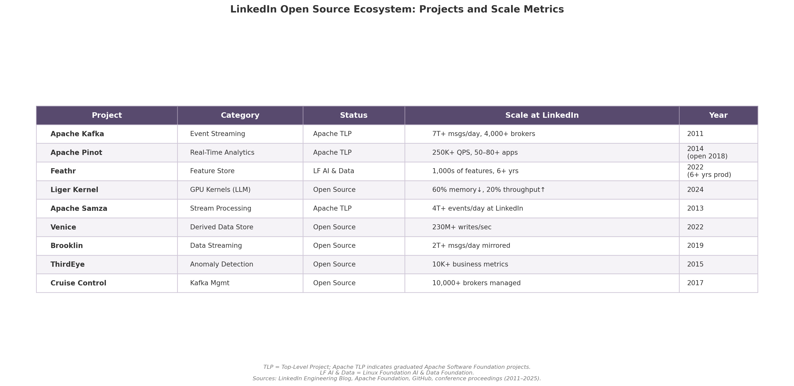

## 9. Infrastructure and Open Source: The Engine Room

Every AI system described in the preceding chapters — from Feed-SR's transformer-based ranking to LiGNN's billion-node graph embeddings — depends on a substrate of data infrastructure that rarely appears in research papers but determines whether models train at all. LinkedIn's open-source portfolio is not peripheral marketing; it is the operational foundation that moves 7 trillion messages daily, serves 250,000 queries per second, and compresses feature engineering cycles from weeks to days. This chapter examines the core infrastructure projects that originated inside LinkedIn and now power both the company's internal AI pipelines and substantial fractions of the global data ecosystem.

The table above summarizes nine major projects spanning event streaming, real-time analytics, feature management, GPU optimization, and operational monitoring. Four have graduated to Apache Top-Level Project (TLP) status — a transition that signals not merely code quality but sustained community governance. The concentration of graduated Apache projects from a single company (Kafka, Samza, Pinot, Helix) is unusual in the industry and reflects a deliberate engineering culture that treats external adoption as a quality bar rather than a vanity metric [^136^]. Igor Perisic, LinkedIn's Vice President of Engineering and Chief Data Officer, articulated this philosophy directly: "We consider community adoption to be our key indicator of success" [^136^]. The practical consequence is that LinkedIn must build software robust enough to survive outside its own data centers — a standard that also benefits internal deployments.

### 9.1 Core Open Source Projects

#### 9.1.1 Apache Kafka: The Central Nervous System

Apache Kafka began as an internal LinkedIn project in 2010, created by engineers Jay Kreps, Neha Narkhede, and Jun Rao to solve a specific failure mode: the company's existing data infrastructure could not handle the volume of event data generated by a rapidly growing professional network [^118^][^120^]. At the time, LinkedIn relied on databases designed for data at rest and traditional messaging systems ill-suited to streaming workloads. Kafka was engineered as a distributed commit log — a persistently stored, partitioned, and replicated stream of records that could both buffer real-time consumers and feed batch analytics systems.

The system was open-sourced in June 2011 and donated to the Apache Software Foundation, where it became one of the most successful projects in the foundation's history [^118^]. By July 2011, the open-source version was already processing 1 billion messages per day. That figure grew to 200 billion by 2013, 1 trillion by 2015, and reached 7 trillion messages per day by 2019 — a 7,000x increase in eight years [^118^]. Today, LinkedIn operates more than 4,000 Kafka brokers organized into 100+ clusters, managing 7 million+ partitions and 100,000+ topics at a peak throughput of 4.5 million messages per second [^118^]. Over 80% of Fortune 100 companies now use Kafka, and the project spawned Confluent — a public company valued at over $10 billion [^118^][^136^].

For LinkedIn's AI systems, Kafka functions as the central data transport layer connecting virtually every subsystem. Member activity events — page views, search queries, ad impressions, content engagements — flow through Kafka to both offline batch analytics (Hadoop) and real-time online services [^118^]. Apache Samza, LinkedIn's stream processing framework and another Apache TLP, consumes from and produces to Kafka for all real-time processing jobs. Streaming Apache Beam pipelines read from Kafka to generate real-time ML features, eliminating the 24–48 hour delay that previously existed with offline-only feature generation [^30^]. The Anti-Abuse platform (Chronos) reads user activity events from Kafka, aggregates them, and triggers AI scoring models — reducing abuse labeling latency from one day to five minutes [^30^]. Kafka also powers change data capture for Espresso, LinkedIn's internal NoSQL store, and asynchronously uploads derived data into Venice, the company's derived-data serving store [^118^].

#### 9.1.2 Apache Pinot: Sub-Second Analytics at 250,000 QPS

Apache Pinot was developed at LinkedIn in 2014 in response to a single high-visibility feature: "Who Viewed My Profile." The feature's launch caused engagement to surge to unprecedented levels, but the existing infrastructure — Kafka for ingestion, Hadoop for storage, and Sensei/Bobo for querying — could not handle the query load. Pinot founding engineer Kishore Gopalakrishna recalled that the team went "from hundreds to over a thousand queries per second, requiring cluster expansions of hundreds of nodes just to maintain SLAs" [^157^]. Pinot replaced this stack with a purpose-built distributed OLAP (Online Analytical Processing) datastore designed for columnar storage, real-time streaming ingestion from Kafka, and sub-second query latency on petabyte-scale datasets [^146^].

The architectural transformation was dramatic. "Who Viewed My Profile" went from requiring thousands of nodes to just 75 nodes while serving close to 5,000 queries per second with latencies of 84–136 milliseconds — with no cache layer involved [^157^]. Pinot now powers 50–80+ user-facing applications at LinkedIn, serving 250,000+ queries per second across hundreds of billions of records [^146^]. These applications span "Who Viewed My Profile," Talent Insights, Ad Analytics, Publisher Analytics, Feed Analytics, Employee Analytics, internal dashboards, and ThirdEye anomaly detection [^107^][^145^][^157^]. Pinot also computes near-real-time features for feed personalization, retrieving member actions with attributes in under 50ms at 20,000+ queries per second [^99^], and stores feature drift statistics computed by the Health Assurance platform for ML model monitoring [^128^]. Pinot's adoption has extended well beyond LinkedIn — Uber, Stripe, DoorDash, Walmart, and Cisco WebEx all operate production deployments [^157^].

#### 9.1.3 Feathr: Point-in-Time Correctness for Feature Engineering

Feathr is LinkedIn's enterprise feature store, open-sourced in April 2022 after more than six years of internal production use. It joined the LF AI & Data Foundation in September 2022 [^127^][^130^][^133^]. Before Feathr, each LinkedIn team maintained bespoke feature pipelines that were difficult to scale, prone to training-serving skew, and prevented feature reuse across projects [^104^]. Adding a new feature required weeks of engineering time, and no common abstraction existed for feature naming, typing, or deployment patterns [^133^].

Feathr operates as an abstraction layer between raw data sources and ML model workflows, providing a unified feature namespace through a producer-consumer model [^104^]. Feature engineers (producers) define and register features based on raw data sources; data scientists (consumers) import features by name without understanding implementation details. The system's defining capability is **point-in-time correctness** — it automatically computes feature transformations and joins them to training data using temporal semantics that prevent data leakage, a failure mode where future information inadvertently contaminates training labels [^127^][^130^]. This is particularly critical for sequential models like Feed-SR, where a single temporally incorrect feature can inflate offline metrics while degrading online performance. Feathr also provides built-in optimizations including Bloom filters and salted joins, enabling it to process billions of rows and petabyte-scale datasets efficiently.

The impact at LinkedIn has been substantial. Teams reported reducing engineering time for adding new features from weeks to days, observed performance improvements of up to 50% compared to custom pipelines, and enabled feature sharing between similar applications leading to measurable business metric improvements [^104^]. Feathr manages thousands of features powering dozens of applications across Search, Feed, and Ads [^130^].

### 9.2 ML Training and Serving Infrastructure

#### 9.2.1 Liger Kernel: GPU Efficiency for LLM Training

Released in August 2024, Liger Kernel is a collection of efficient Triton kernels for LLM training that achieves approximately 20% increase in training throughput and approximately 60% reduction in GPU memory usage compared to standard Hugging Face implementations [^98^][^105^]. The technical approach centers on **operator fusion** — combining multiple standalone GPU kernels into a single kernel to eliminate per-operation time and memory overhead. Specifically, Liger Kernel fuses operations to eliminate HBM-to-SDRAM memory traffic, uses in-place replacement to reduce memory allocation overhead, and implements chunking and blockwise computation to avoid materializing full logits — a critical optimization for models with large vocabulary spaces [^102^].

The benchmarks vary by model architecture. For LLaMA 3-8B, Liger Kernel achieves a 42.8% throughput gain with 54.8% memory reduction; for Qwen2, 25.5% throughput and 56.8% memory reduction; for Mistral 7B, 27% throughput and 21% memory reduction [^98^]. A particularly striking result is that Hugging Face models begin to encounter out-of-memory (OOM) errors at 4K context length, while Hugging Face plus Liger Kernel scales to 16K context length on the same hardware [^98^]. Liger Kernel is implemented using OpenAI's Triton programming language and is compatible with Flash Attention, PyTorch FSDP, and Microsoft DeepSpeed, with rigorous unit and convergence testing ensuring exact computation — no approximations [^98^][^102^].

At LinkedIn, Liger Kernel contributed to a 3x reduction in end-to-end training time for an in-house approximately 70-billion-parameter model, and 10–20% throughput gains for models at approximately 100-billion and approximately 10-billion scales [^102^]. Combined with other optimizations including fused operations and Avro accelerations, LinkedIn saved 275,000 GPU hours [^121^]. The kernels are integrated into LinkedIn's production LLM training stack: Flyte for workflow orchestration, Kubernetes for container orchestration, and GPU clusters for distributed training [^102^]. Community adoption has been strong — by early 2025, Liger Kernel accumulated 3,000+ GitHub stars, 200,000+ downloads, 40+ contributors, and 250+ pull requests, with integration into major training frameworks including Axolotl, LLaMA-Factory, and Hugging Face Trainer [^98^]. The work was published as an arXiv technical report (arXiv:2410.10989) and presented at OpenReview [^105^][^100^].

#### 9.2.2 Pro-ML and Health Assurance: Monitoring Hundreds of Models

Pro-ML is LinkedIn's centralized machine learning platform providing lifecycle management for hundreds of AI models serving members and customers [^128^][^131^]. The platform's **Health Assurance (HA)** component addresses a challenge that becomes critical at scale: monitoring production model health across hundreds of independently deployed models, each with distinct feature distributions, latency requirements, and business impact.

Before Health Assurance, individual teams at LinkedIn developed their own monitoring systems, which fragmented approaches across the organization and significantly decreased AI engineer productivity [^128^]. The HA platform embeds monitoring directly into inference applications, capturing real-time feature distributions with minute-level granularity, tracking inference latency at mean, P50, P75, P90, and P99 percentiles, and running daily batch jobs that compute feature drift statistics and push them to Pinot for storage and ThirdEye for alerting [^128^]. A key architectural innovation is the **Metrics Aggregator**: with approximately 1,000 models deployed across 500 hosts, tracking 10 features with 5 metrics each would generate 25 million metric keys using a naive host-level approach. The Metrics Aggregator solves this by aggregating at the model level rather than the host level, reducing cardinality by orders of magnitude [^128^].

Pro-ML enforces a **three-phase deployment pipeline** that gates model releases: **Dark Canary**, where models run without serving real traffic to catch inconsistencies before going live; **Experimentation**, where a small percentage of production traffic is routed to the new model with monitoring of both business and technical metrics; and **Majority Member Experience (MME)**, where the model receives full production traffic with continuous real-time distribution monitoring [^128^]. This graduated rollout mechanism has proven essential for detecting issues that offline evaluation misses — particularly feature distribution shifts that occur only under full production load.

#### 9.2.3 LiNR and GPU-Based Neural Retrieval

LinkedIn's neural retrieval infrastructure, including systems like LiNR (LinkedIn Neural Retrieval), extends the GPU optimization work of Liger Kernel into the serving path. The platform's retrieval stack processes embeddings at single-digit millisecond latencies — a requirement for maintaining end-to-end SLAs when each user request triggers dozens of embedding lookups across multiple candidate generation systems [^111^]. LinkedIn trains models with 100+ billion parameters but compresses them to 7–8 billion parameters for inference using distillation, pruning, and quantization techniques. According to Animesh Singh, Executive Director of AI and ML Platform at LinkedIn, "This approach makes running AI at scale ROI-positive" [^111^].

LinkedIn's GPU infrastructure strategy reflects the practical realities of operating at billion-user scale. The company achieved a 30x expansion in petaflops capacity with rearchitected networking for GPU efficiency [^111^]. Reliability challenges are acute: with H100 and H200 GPUs experiencing approximately 10% thermal stress failure rates, LinkedIn implements rapid checkpointing, automated recovery, intelligent job rescheduling, and what Singh describes as treating "GPUs as pets, not cattle" — individual GPU tracking and care rather than treating all units as fungible [^111^]. These operational investments, while less visible than model architecture innovations, determine whether AI systems remain available when 1.2 billion members open the app [^121^].

The full infrastructure stack supporting LinkedIn's AI systems can be understood as a layered architecture: Flyte for workflow orchestration, Kubernetes for container orchestration, PyTorch and Hugging Face Trainer for model development, FSDP and DeepSpeed for distributed training, Liger Kernel and Flash Attention for GPU optimization, Apache Samza and Apache Beam for stream processing, Kafka for event transport, Pinot for real-time analytics, Feathr for feature management, and Venice for online serving of derived data [^102^][^111^][^118^]. Each layer is optimized for the specific demands of serving AI at LinkedIn's scale — a system where 7 trillion messages, 250,000 queries per second, and billions of graph traversals occur daily, all while maintaining sub-100-millisecond response times for the member-facing surfaces that depend on them.
